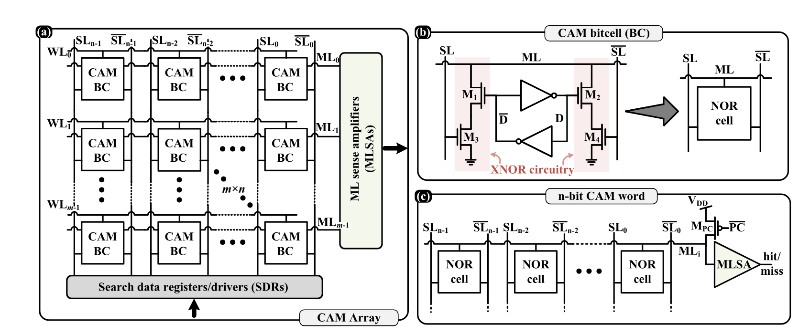
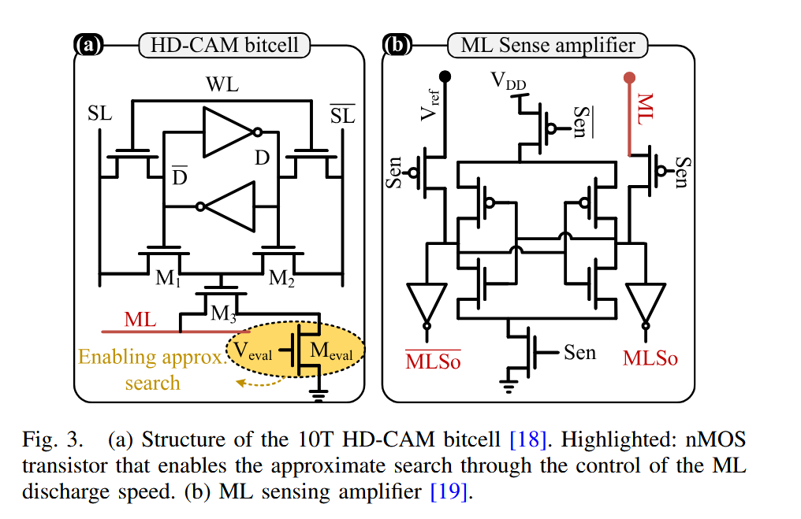

# CAM 设计

## 1. 文档目的

这份文档说明我们在 `GraphhopSimhash` 里的 CAM 设计思路，重点不是普通 CAM 的精确检索，而是：

```text
如何把 CAM 扩展成 HD-CAM，
用于 8 个 16bit 哈希头的近似匹配搜索。
```

这里的“HD”指的是 Hamming Distance，也就是汉明距离。

我们的目标不是只找：

```text
查询哈希 == 存储哈希
```

而是找：

```text
查询哈希与存储哈希足够接近
```

这样才能把 CAM 用在哈希复用前端，而不是只做严格的 exact match。

---

## 2. 普通 CAM 的基本架构

普通 CAM 的核心作用是：

```text
把查询值同时和很多存储行做比较，
快速找出“完全相同”的条目。
```

对应的普通 CAM 架构如下：



这张图可以分成三层来看。

### 2.1 CAM Array

左侧大框是 CAM 阵列。

- 每一列对应一个 bit 位
- 每一行对应一个存储 word
- 每个小方块是一个 CAM bitcell

如果阵列是 `m x n`，含义就是：

```text
m 行存储 word
n 位比较宽度
```

### 2.2 Search Data Registers / Drivers

底部的 `Search data registers/drivers` 负责把查询数据送到所有搜索线（`SL` / `SL_bar`）。

也就是说，一次查询不是一行一行比，而是：

```text
同一个查询值，同时广播到整列 bitcell
```

### 2.3 Match Line 和 Sense Amplifier

每一行都有一根 `ML`，也就是 match line。

普通 CAM 的工作方式可以概括成：

```text
如果这一行每一位都匹配，
这一行的 ML 保持在“命中”状态；

如果其中任意一位不匹配，
这一行的 ML 就被拉到“未命中”状态。
```

最后由右侧的 `ML sense amplifiers` 做出：

```text
hit / miss
```

判决。

所以普通 CAM 的本质是：

```text
逐行并行，逐位精确匹配
```

它擅长的是：

```text
找到一模一样的条目
```

但它不直接擅长：

```text
找到“差 1 位、差 2 位”的近似条目
```

这也是我们引入 HD-CAM 的原因。

---

## 3. 为什么要从普通 CAM 走向 HD-CAM

我们的复用前端使用的是多头短哈希：

```text
8 个 head
每个 head 16bit
```

如果只用普通 CAM，那么每个 head 只能做：

```text
16bit 完全一样才命中
```

这在哈希复用里太严格了，因为真正有价值的候选往往不是完全相同，而是：

```text
汉明距离很小
```

例如：

```text
head hash: 1011001110001111
candidate: 1011001010001111
```

这两个只差 1 位，从复用角度看其实很像。  
如果仍然按普通 CAM 的 exact match 处理，它会被直接丢掉。

所以我们需要 CAM 支持下面这种查询：

```text
找出所有 HD <= T 的行
```

这就是 HD-CAM 的用途。

---

## 4. HD-CAM bitcell

我们参考的 HD-CAM 单元结构如下：



这张图最关键的不是整个锁存结构，而是左图里额外加进去的：

```text
Meval
```

以及它对应的控制电压：

```text
Veval
```

普通 CAM 的思路是：

```text
只判断“有无不匹配”
```

而 HD-CAM 的思路是：

```text
让“不匹配位的数量”影响 ML 的放电速度
```

也就是：

- 不匹配位少：ML 放电慢
- 不匹配位多：ML 放电快

这样一来，match line 不再只是一个二值信号，而变成了一个能够反映：

```text
这一行和查询值差多少位
```

的模拟量。

---

## 5. HD-CAM 的核心物理机制

### 5.1 普通 CAM 的问题

普通 CAM 中，只要有 bit 不匹配，就会把 ML 拉向 miss。

所以它更像是：

```text
0 个错误 -> hit
1 个及以上错误 -> miss
```

这种机制不能区分：

```text
差 1 位
差 2 位
差 6 位
```

因为在普通 CAM 里，它们都会被粗暴地归为 miss。

### 5.2 HD-CAM 的改法

HD-CAM 不再只问“错没错”，而是利用 `Meval` 控制 ML 的放电行为，让：

```text
汉明距离越大
ML 在固定时间内掉得越快
```

从而把：

```text
HD
```

映射成：

```text
ML 电压
```

如果写成概念公式，就是：

```text
V_ML = VDD * exp(-G_total * t_eval / C_ML)
```

其中：

- `VDD`：供电电压
- `G_total`：总放电导通
- `t_eval`：评估时间
- `C_ML`：match line 电容

对我们最重要的直觉是：

```text
HD 越小，V_ML 越高
HD 越大，V_ML 越低
```

于是就可以通过一个感测阈值，把“够近”和“不够近”分开。

---

## 6. HD-CAM 的感测方式

右图给出了 `ML Sense amplifier`。

这里的作用不是再做一次数字 popcount，而是直接比较：

```text
当前 ML 的电压
和
参考阈值 Vref
```

其逻辑可以写成：

```text
如果 V_ML >= Vref，则判为命中
如果 V_ML <  Vref，则判为不命中
```

这样一来，我们就可以把：

```text
HD <= 2
```

这类条件，转成一个模拟阈值判决。

例如：

- `d = 0` 时，ML 电压最高
- `d = 1` 时，ML 电压稍低
- `d = 2` 时，ML 电压再低一点
- `d = 3` 时，ML 电压进一步降低

如果把 `Vref` 放在：

```text
d = 2 和 d = 3
```

之间，那么理论上就能实现：

```text
HD <= 2 -> hit
HD >= 3 -> miss
```

这就是我们需要的近似匹配能力。

---

## 7. 我们的 HD-CAM 系统设计

### 7.1 基本组织

我们不打算用一个超长哈希直接做 CAM，而是采用：

```text
8 个独立 head
每个 head 16bit
```

对应的硬件组织是：

```text
Head0 -> 一个 16bit HD-CAM bank
Head1 -> 一个 16bit HD-CAM bank
...
Head7 -> 一个 16bit HD-CAM bank
```

也就是说：

```text
每个 head 单独做近似匹配搜索
8 个 head 并行工作
```

### 7.2 为什么选 16bit

这不是随便选的，而是因为 16bit 对 HD-CAM 更现实：

1. 字长短，ML 负载更可控  
2. `d=2` 和 `d=3` 的边界更容易分开  
3. 比直接做一个 `128bit` CAM 更容易调阈值和控制误差  

所以我们采用的是：

```text
多头短码
而不是
单头长码
```

---

## 8. 用 HD-CAM 做 8 个 16bit 哈希匹配的流程

完整流程如下。

### 第 1 步：生成 8 个 16bit 哈希

对当前节点，前端先得到：

```text
h0, h1, h2, ..., h7
```

每个 `hi` 都是一个 16bit 哈希。

### 第 2 步：8 个 CAM bank 并行查询

每个 `hi` 分别送入对应的 HD-CAM bank：

```text
h0 -> CAM bank 0
h1 -> CAM bank 1
...
h7 -> CAM bank 7
```

在每个 bank 内部：

1. 先预充每行 ML  
2. 查询值通过 `SL / SL_bar` 广播到所有 bitcell  
3. 每行根据 mismatch 数量产生不同放电速度  
4. 在 `t_eval` 时刻读取 ML  
5. 通过 `Vref` 判定该行是否满足近似匹配阈值  

这样每个 head 都会返回一批：

```text
HD 足够小的候选行
```

### 第 3 步：把候选行映射回 node_id

每条命中行都绑定一个缓存节点 `node_id`。

因此每个 head 返回的不是抽象“某行命中”，而是：

```text
哪个旧节点在这个 head 上足够接近
```

### 第 4 步：跨 head 聚合 support

如果同一个 `node_id` 在多个 head 都命中，就说明这个候选不是偶然碰撞，而是：

```text
从多个哈希视角都支持它
```

于是我们统计：

```text
support_count
```

也就是该节点被几个 head 共同命中。

例如：

```text
node A 命中 head0, head2, head5, head7
-> support_count = 4
```

### 第 5 步：做三段式决策

HD-CAM 前端给出的不是最终 embedding，而是：

```text
候选 node_id + support_count
```

然后再进入三段式决策：

```text
support 很高 -> hard direct reuse
support 中等 -> residual reuse
support 很低 -> compute
```

在我们当前 `cora` 实验里，比较均衡的一组切法是：

```text
8 heads
hard_direct >= 6
residual_soft = 4..5
compute < 4
```

这意味着：

- `6~8` 个 head 同时支持：可以认为很稳，直接复用
- `4~5` 个 head 支持：属于中间态，交给 residual 修正
- `0~3` 个 head 支持：置信度不够，重新计算

这里要强调：

```text
HD-CAM 负责找“近似候选”
最终是否复用，要看多头 support 聚合结果
```

---

## 9. 我们的设计与普通 CAM 的差别

普通 CAM：

```text
每一行只有 hit / miss 两种意义
```

我们的 HD-CAM：

```text
每一行的 ML 放电速度携带“距离信息”
```

因此它不是在做：

```text
有没有完全相同的 16bit
```

而是在做：

```text
有没有若干个旧节点，
它们在若干个 head 上都和当前节点足够接近
```

这正适合哈希复用，而不适合只做传统精确检索。

---

## 10. 为什么这种设计适合 GraphhopSimhash

对我们这个项目来说，HD-CAM 的好处主要有四点。

### 10.1 近似检索能力更符合复用需求

GraphhopSimhash 不需要“严格相同”，而需要：

```text
足够相似，可以复用
```

HD-CAM 正好提供这种能力。

### 10.2 多头设计天然适合做支持票数

我们本来就是多头哈希，所以硬件前端天然可以产生：

```text
support_count
```

这比单个长码的单次距离更适合做 confidence 估计。

### 10.3 16bit/head 降低了 HD-CAM 的实现难度

如果直接在 `64bit` 或 `128bit` 上做严格阈值感测，电路压力更大。  
拆成 `16bit x 8 heads` 后，单个 bank 的感测边界更容易控制。

### 10.4 前端 HD-CAM 与后端 residual 可以解耦

我们的前端可以只负责：

```text
近似匹配和候选筛选
```

后端再负责：

```text
direct reuse / residual reuse / compute
```

这样系统分工清楚，便于单独优化。

---

## 11. 设计边界

这份设计文档描述的是：

```text
HD-CAM 作为哈希复用前端的体系结构
```

它强调的是：

- bitcell 如何从普通 CAM 走向 HD-CAM
- ML 放电如何表达汉明距离
- 8 个 16bit head 如何并行搜索
- support 聚合如何接到 reuse 决策

它没有在这里展开：

- 具体版图大小
- PVT 角落分析
- 噪声和失配下的误判率
- 完整 sense margin 校准流程

这些是后续电路级验证和仿真的工作。

---

## 12. 一句话总结

一句话概括我们的 HD-CAM 设计：

```text
把普通 CAM 的“完全相同才命中”，
改造成“ML 放电速度反映汉明距离、阈值感测决定近似命中”，
然后让 8 个 16bit 哈希头并行搜索，
再通过多头 support 聚合驱动 direct / residual / compute 三段式复用决策。
```
