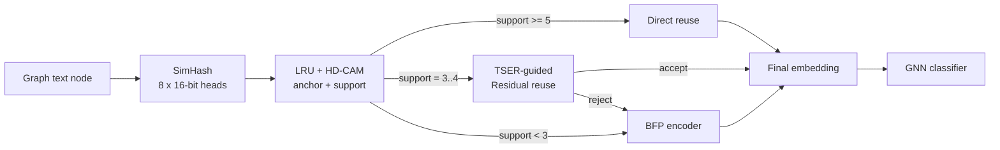

# Residual-Gate Reuse and Graph-Aware BFP NPU Progress

本文档记录当前可作为论文主线的两段机制：

```text
1. TSER-guided residual reuse:
   解决 fuzzy SimHash/CAM hit 的安全复用问题。

2. Graph-aware BFP encoder:
   解决 reject / miss nodes 的低成本 encoder 计算问题。
```

---

## 1. Overall Pipeline



三类节点：

```text
high-confidence hit:
    cache read

fuzzy hit:
    residual correction + accept gate

miss / rejected hit:
    BFPA4/BFPA6 encoder
```

---

## 2. TSER-Guided Residual Reuse

SimHash/CAM 找到 anchor 后，还需要判断复用风险。TSER 使用图传播风险和语义风险：

```text
sensitivity_q =
    3 * propagation_q
  + 1 * graph_context_q
  + 1 * low_unique_q

reuse_risk = sensitivity_q * reuse_error_q
```

TSER 的作用：

```text
1. 高风险 fuzzy hit 不轻易进入 reuse。
2. 中风险 fuzzy hit 进入 residual adapter。
3. residual accept gate 再判断修正结果是否保留。
```

Residual adapter 在线计算：

```text
delta, accept_score = MLP(pair_feature(v, u))

if accept_score >= tau:
    E_hat(v) = E(u) + alpha * delta
else:
    reject -> BFP encoder
```

其中 `E(u)` 是 CAM anchor 的 cached embedding。`delta` 是在当前 target embedding space 中学习到的修正量。

### 2.1 Cora / LLaMA BFPA Target Result

| Target | Direct Reuse | Direct Drop | SoftDirect Reuse | SoftDirect Drop | Residual Reuse | Residual Drop |
|---|---:|---:|---:|---:|---:|---:|
| BFPA6 | 15.7% | 0.71% | 51.6% | 2.56% | 39.1% | 1.24% |
| BFPA4 | 15.7% | 0.42% | 50.3% | 2.80% | 38.5% | 1.74% |

结论：

```text
SoftDirectReuse 全收 fuzzy hit，reuse 高但 drop 偏大。
ResidualReuse 过滤脏 fuzzy hit，把 drop 压回 2% 内。
```

---

## 3. Graph-Aware BFP Encoder

Residual gate 拒绝的节点和 CAM miss 节点仍然需要 encoder。当前主线使用 BFP activation：

```text
BFPA4:
    low-cost default

BFPA6:
    high-risk refinement

BFPA8:
    conservative reference / optional high-precision refinement
```

TSER / Degree 在后端的作用：

```text
rank miss nodes by graph risk
top-risk nodes -> BFPA6/BFPA8
remaining nodes -> BFPA4
```

这里的关键不是 BFP 格式本身，而是把图任务风险接入 miss-node encoder precision 选择。

### 3.1 BFP Progressive Refinement Result

| Dataset | Policy | Selector | Cost | Drop |
|---|---|---|---:|---:|
| Cora | 30% BFPA6 + 70% BFPA4 | TSER | 0.319 | 0.49% |
| PubMed | 30% BFPA6 + 70% BFPA4 | Degree | 0.319 | 0.54% |

更完整 sweep 见：

```text
docs/archive/results/GRAPH_BFP_PROGRESSIVE_REFINEMENT_RESULT.md
```

---

## 4. Explored Alternatives

以下路径已验证或初步验证后降级：

```text
partial-depth encoder:
    L4/L8/L16 hidden state 直接替代 final embedding，drop 太大。

cross-row BFP packing:
    full activation-level cross-row BFPA4 过激，rowwise BFPA4 更稳。

prediction-free bit-plane early stop:
    思路有硬件价值，但当前 bound validation 不够稳。

token compaction / FFN channel gating:
    不作为当前主贡献。
```

这些探索的作用是帮助确定当前主线：

```text
reuse first,
residual-gate fuzzy hits,
then graph-aware BFP refinement for remaining miss nodes.
```
