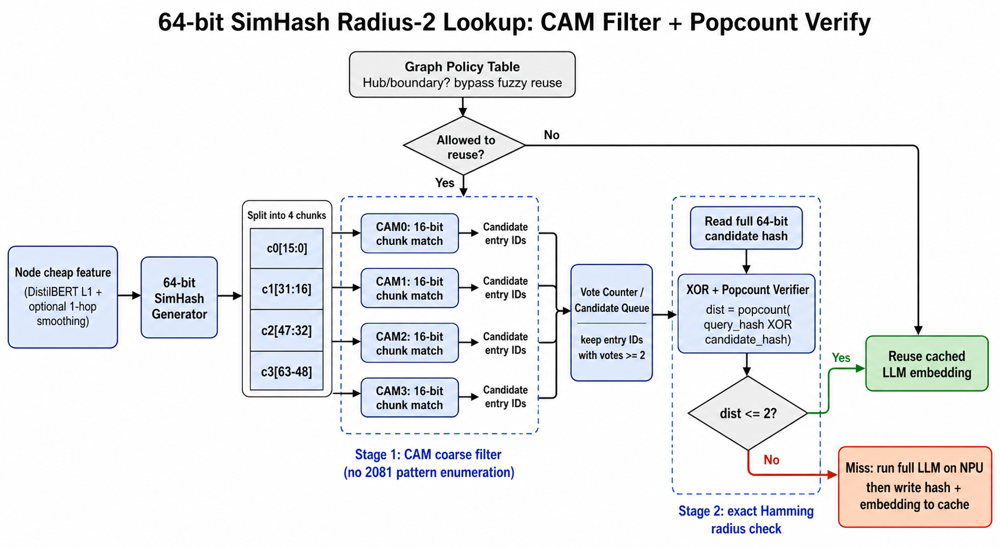
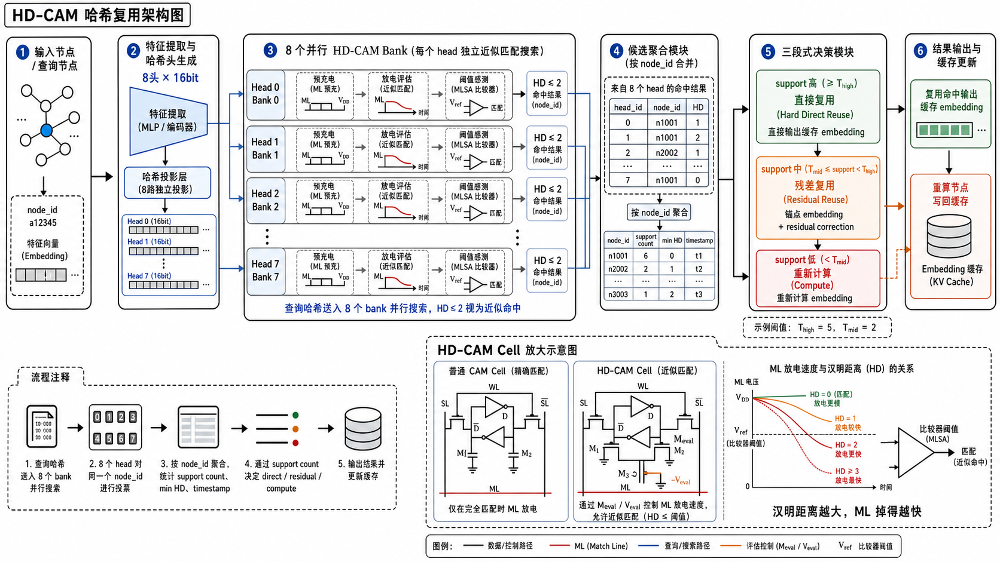

# CAM 设计

## 1. 目标

本文说明我们在 GraphhopSimhash 中如何把普通 CAM 改造成 HD-CAM，并用于：

```text
8 个 16bit 哈希头
汉明距离阈值匹配
多头支持数聚合
直接复用 / 残差复用 / 重新计算三段式复用
```

我们的目标不是只做精确检索，而是找“足够接近”的复用候选。

---

## 2. 普通 CAM 做什么

普通 CAM 的能力很直接：

```text
把查询值同时和所有存储行比较，
找出完全相同的条目。
```

对应架构如下：


图里可以看成三部分：

- `CAM Array`：每行一个存储字，每列一个位
- `Search Data Registers / Drivers`：把查询值广播到所有位单元
- `ML sense amplifiers`：最终输出命中或未命中

普通 CAM 的本质是：

```text
逐行并行，逐位精确匹配
```

它适合 exact match，不适合直接回答“差 1 位、差 2 位是否也算命中”。

之前采用的普通 CAM 检索（CAM粗筛 + XOR/popcount）流程如下：



---

## 3. 为什么要上 HD-CAM

在哈希复用里，真正有价值的候选往往不是完全相同，而是：

```text
汉明距离很小
```

我们现在是：

```text
8 个哈希头
每个哈希头 16bit
```

如果继续用普通 CAM，只能做“16bit 完全一样才命中”，太严格了。  
所以需要把 CAM 改成：

```text
找出所有 HD <= T 的行
```

这就是 HD-CAM 的作用。

---

## 4. HD-CAM cell

HD-CAM 的关键不是把 CAM 改成更复杂的存储单元，而是让匹配线能反映“差了几位”。

参考的 HD-CAM cell 如下：


这里最关键的是新增的：

- `Meval`
- `Veval`

普通 CAM 只判断“有没有不匹配”；  
HD-CAM 则让“不匹配位的数量”影响匹配线的放电速度。

直觉上就是：

- 不匹配位少，ML 放电慢
- 不匹配位多，ML 放电快

因此，匹配线不再只是二值信号，而是一个近似距离的物理载体。

---

## 5. 物理判决逻辑

HD-CAM 的基本判决可以抽象成：

```text
V_ML = VDD * exp(-G_total * t_eval / C_ML)
```

其中：

- `VDD`：供电电压
- `G_total`：总放电导通
- `t_eval`：评估时间
- `C_ML`：匹配线电容

核心关系很简单：

```text
汉明距离越大 -> 放电越快 -> V_ML 越低
汉明距离越小 -> 放电越慢 -> V_ML 越高
```

然后用参考阈值 `Vref` 做比较：

```text
V_ML >= Vref -> hit
V_ML <  Vref -> miss
```

如果把 `Vref` 放在 `d = 2` 和 `d = 3` 之间，就能近似实现：

```text
HD <= 2 -> 命中
HD >= 3 -> 不命中
```

这比普通 CAM 的 exact match 更适合哈希复用。

---

## 6. 8 个 16bit 哈希头的组织方式

我们不把一个长哈希直接丢进 CAM，而是采用：

```text
8 个独立哈希头
每个哈希头 16bit
```

对应到硬件上，就是 8 个并行存储体：

```text
Head0 -> HD-CAM 存储体 0
Head1 -> HD-CAM 存储体 1
...
Head7 -> HD-CAM 存储体 7
```

这样做有三个好处：

1. 单个存储体字长短，阈值更容易调
2. 8 个哈希头可以天然提供支持数置信度
3. 前端候选筛选和后端复用决策可以解耦

---

## 7. 我们的完整哈希复用架构

我们把上面的思想组合成一张完整架构图：



这张图表达的是整条链路：

1. 输入节点进入前端，读取或生成 8 个 16bit 哈希头。
2. 同时读取风险字段，例如 `sensitivity_q`、`propagation_q`、`low_unique_q`。
3. 8 个 HD-CAM 存储体并行搜索，每个存储体对一个哈希头做 `HD <= 2` 阈值命中。
4. 每个命中行返回候选 `node_id`、汉明距离、命中头数量和时间戳。
5. 数字聚合逻辑按 `node_id` 合并多头结果，得到候选的支持数、最小距离和候选新旧程度。
6. 统一前端策略先做分数门控，过滤高风险候选。
7. 通过门控后，再按支持数分派到直接复用、残差复用或重新计算。
8. 重新计算的节点写回 CAM；已经复用的节点不写入新条目，只更新后续统计。

所以这张图对应的不是单纯的 CAM 检索，而是一个完整的哈希复用前端：HD-CAM 负责产生近似候选，数字逻辑负责候选聚合、风险过滤、路径分派和缓存更新。

---

## 8. 统一前端决策

HD-CAM 前端返回的不是最终嵌入向量，而是候选、距离和支持数。

当前主线不是旧版“只按支持数切三段”的策略，而是：

```text
HD-CAM 候选
-> 多头候选聚合
-> 分数门控
-> 直接复用 / 残差复用 / 重新计算
```

固定结构参数如下：

```text
R = 2
8 个 16bit 哈希头
候选基础门限: 支持数 >= 3
直接复用门限: 支持数 >= 5
残差复用范围: 3 <= 支持数 < 5
```

分数门控在支持数分派之前执行。它使用候选距离、支持数和节点风险字段计算复用风险：

```text
候选距离越大，风险越高
候选支持数越高，风险折扣越大
节点灵敏度越高，风险越高
枢纽节点 / 稀有叶子节点可以触发保护性拒绝
```

然后使用数据集相关的分数阈值 `T` 判断是否允许复用。当前统一前端的代表性口径是：

```text
Cora:  T = 31
Arxiv: T = 22
```

最终路径规则为：

```text
没有候选，或支持数 < 3:
    重新计算

候选没有通过分数门控:
    重新计算

候选通过分数门控，且支持数 >= 5:
    直接复用

候选通过分数门控，且 3 <= 支持数 < 5:
    残差复用
```

也就是说，支持数大于等于 5 并不单独保证复用，它还要先通过分数门控；支持数等于 3 到 4 也不再无条件进入残差路径，而是先接受风险过滤。

当前结果不再使用旧的固定参数和旧结论：

```text
旧口径:
    T = 40
    支持数 = 4 才进入残差路径
    Cora 复用 = 25.7%, 掉点 = 0.45%
    PubMed 复用 = 50.3%, 掉点 = 2.52%
```

这些旧数字只适合追溯早期探索，不应作为当前主结论。

当前 `CAM_sim` 下与统一前端最接近的代表性回放口径如下，具体实验产物仍以 `CAM_sim/reports` 和 `docs/results` 为准：

| 数据集 | 容量口径 | 阈值 | 复用 | 直接 | 残差 | FullP8 掉点 |
|---|---|---:|---:|---:|---:|---:|
| Cora | 512KB 全局 LRU | 31 | 47.3% | 21.5% | 25.8% | 1.64% |
| Arxiv | 512KB 全局 LRU | 22 | 45.1% | 20.5% | 24.6% | 3.23% |

所以，HD-CAM 只负责“找近似候选”，最终能不能复用，要看候选聚合、分数门控和复用路径分派共同决定。

---

## 9. 这种设计为什么适合 GraphhopSimhash

这套设计和我们的任务是对齐的。

### 9.1 复用需要的是近似，不是精确

GraphhopSimhash 不追求“完全相同”，而是要找“足够相似”的旧节点。

### 9.2 多头支持数比单次命中更稳

一个候选如果在多个哈希头上都命中，说明它不是偶然碰撞，而是更像真正可复用的锚点。

### 9.3 16bit 哈希头更适合做阈值感测

短字长更容易把 `d=2` 和 `d=3` 拉开；这比直接做一个超长 128bit CAM 更现实。

### 9.4 前端与后端职责清晰

- HD-CAM 前端：负责近似搜索和候选筛选
- 数字后端：负责支持数聚合、残差修正、最终决策

这样系统更清楚，也更容易继续优化。

---

## 10. 频率估算与工艺边界

Garzón 等人的 HD-CAM 论文给出的硅片基线是：

```text
128-kbit approximate-search CAM
65nm CMOS
64bit 查询值 / CAM 存储字量级
最高测试频率 125MHz
```

这个结果可以作为我们的硬件外推锚点，但不能直接当成 GraphhopSimhash 的实测频率。原因是我们的前端不是单个长存储字，而是：

```text
8 个并行 HD-CAM 存储体
每个存储体只做 16bit 哈希头
每个哈希头的汉明距离阈值 R = 2
```

从匹配线物理行为看，16bit 哈希头比 64bit 存储字更容易跑高频：

```text
存储字从 64bit 缩到 16bit
-> 单条匹配线上挂载的位单元数量约降到 1/4
-> C_ML 显著下降
-> 预充 / 评估的 RC 延迟下降
-> 允许更短搜索周期
```

`R = 2` 也是比较自然的阈值选择：

```text
16bit 下 HD = 2  -> 2 / 16 = 12.5%
64bit 下 HD = 8  -> 8 / 64 = 12.5%
```

也就是说，16bit 哈希头、R=2 保留了和 64bit、R=8 类似的相对容错比例，同时把每条匹配线的负载大幅缩短。工程上可以把它理解成“更短的模拟判决线 + 合理的 HD 感测裕度”。

在没有重新版图和 SPICE/PVT 仿真的情况下，本文只采用如下估算口径：

| 设计点 | 频率结论 | 说明 |
|---|---:|---|
| 65nm, 64bit HD-CAM | 125MHz | Garzón 等人的硅片实测基线 |
| 65nm, 16bit 哈希头, R=2 | 300-500MHz | 基于匹配线负载下降的工程外推 |
| 28nm, 16bit 哈希头, R=2 | 0.8-1.5GHz | 同时考虑短字长和工艺缩放后的工程外推 |

当前 `CAM_sim` 主结果按 `500MHz` 统一建模。`1GHz` 可以作为 28nm 下短匹配线的未来外推讨论，但不应写成当前默认仿真频率。正式论文中应写成：

```text
当前 CAM 模拟器按 500MHz 评估。更高频点，例如 1GHz，只能作为
28nm 下 8 个 16bit 哈希头的多头 HD-CAM 工艺外推点，不能写成实测结果。
```

边界也要明确：

- 最高频率最终取决于版图后的 `C_ML`、搜索线驱动、MLSA、预充、电源电压和 PVT 工况。
- `16bit, R=2` 的误命中 / 误拒绝需要用 Monte Carlo 和提取寄生参数验证。
- 本文可以表述为 `16bit 哈希头降低匹配线负载并支持更高频建模`，不要声称 `28nm 实测达到 1GHz`。

---

## 11. 一句话总结

我们这里的 HD-CAM 设计可以概括成一句话：

```text
把普通 CAM 的“完全相同才命中”，改成“匹配线放电速度反映汉明距离”，
再让 8 个 16bit 哈希头并行搜索，最后通过候选聚合、分数门控和支持数分派决定直接复用、残差复用或重新计算。
```

---

## 12. 主路线与验证路线

针对当前配置：

```text
8 个哈希头
每个哈希头 16bit
每个 CAM 的汉明距离阈值 HD <= 2
```

本文的主路线是 HD-CAM 直接阈值搜索。数字分块加精确校验不是最终硬件主张，而是早期验证方案和对照模型，用来证明同一份轨迹文件、同一套候选聚合和同一套缓存策略下，前端搜索结果是否可解释、可回放。

当前 `CAM_sim` 里同时保留两类模型：

```text
主路线:
    模拟 HD-CAM
    用匹配线放电和参考阈值直接判断 HD <= 2

验证路线:
    数字 CAM 粗筛 + XOR/popcount 精确校验
    用逐位精确结果检查候选、距离、支持数和缓存行为
```

### 12.1 验证路线：普通 CAM 分块粗筛 + XOR/popcount 精确校验

思路如下：

```text
16bit 查询值
-> 切成多个小块
-> 每个小块用普通 CAM 做精确匹配粗筛
-> 保留满足“至少 小块数量 - 半径 个小块相等”的候选
-> 对候选做 XOR + popcount 精确校验
-> 最终判定 HD <= 2
```

这个路线的本质是：

```text
用数字精确路径复现 HD <= 2 的候选集合
```

它在本项目里的主要价值是：

- 输出是逐位精确的，可以作为 HD-CAM 行为模型的对照。
- 可以直接得到精确汉明距离，便于排查候选选择、支持数聚合和回放评估器。
- 便于检查轨迹文件格式、缓存替换、逐节点决策输出是否一致。
- 可以作为保守数字基线，但不是本文最终推荐的低延迟前端。

它不适合作为最终主路线的原因也很直接：

- 16bit 很短，`HD<=2` 时分块粗筛的收益不如 64bit 场景明显
- 分块后会复制 CAM 子阵列、匹配线、编码和候选聚合逻辑，外围开销偏大
- 如果粗筛不够锋利，仍会留下较多候选进入 `XOR + popcount` 二级校验
- 整体是两级路径，最坏情况延迟大于单级阈值比较

这里最关键的判断是：`64bit -> 4 x 16bit 小块` 流程在 64bit 小阈值场景很合适，但缩到单个 16bit 哈希头后，同样的粗筛优势明显下降。

原因是 16bit 太短：

- 如果切成 `4 x 4bit`，则真命中要求至少 `2/4` 个小块完全相等，但随机候选通过粗筛的概率仍然不低
- 如果继续切细，例如切成 `8 x 2bit`，粗筛会更锋利，但小块数量、投票逻辑和外围管理成本也会进一步上升
- 如果切到 `1bit`，则已经接近直接做 popcount，本身就失去粗筛的意义

换句话说：

```text
数字验证路线的核心优势来自“大字宽 + 小阈值”。
当字长缩到 16bit 时，这个优势会明显下降。
```

### 12.2 主路线：HD-CAM 直接做汉明距离阈值比较

思路如下：

```text
16bit 查询值
-> 直接送入 16bit HD-CAM 存储体
-> 利用匹配线放电速度和电压反映不匹配数量
-> 直接判定 HD <= 2 是否成立
```

这个路线的本质是：

```text
不显式求 HD 数值，
而是直接做阈值式近似命中
```

它是主路线的原因是：

- 单级判定，路径更短，更接近真正 CAM 的单拍比较风格。
- 不需要小块切分、二级完整哈希读出和 `XOR + popcount` 校验。
- 对于只关心 `HD<=2?` 的应用，面积和功耗通常更有优势
- `8 x 16bit` 的存储体组织天然适合多头支持数聚合

它的代价是：

- 本质上不是数字精确计数，而是混合信号阈值感测。
- 结果受 `Veval`、`Vref`、PVT、版图寄生和 sensing margin 影响。
- 如果后续需要精确 HD 数值、前 k 个候选或最近邻排序，就不如 `XOR + popcount` 直接
- 设计和验证门槛高于普通数字逻辑

这些代价不会改变主路线判断，但会决定论文表述边界：我们可以主张“HD-CAM 是更匹配当前任务的前端”，但不能把行为级代理模型写成硅片签核结果。

### 12.3 针对 `8 x 16bit, HD<=2` 的主判断

对于当前这个具体设计点，主判断是：

```text
GraphhopSimhash 的最终 CAM 前端优先采用 HD-CAM 直接阈值比较。
数字分块 + XOR/popcount 作为验证方案和对照基线保留。
```

原因如下。

#### (1) 当前任务只需要阈值命中，不需要精确排序

我们这里的前端职责不是：

```text
给出每个候选的精确 HD 排名
```

而是：

```text
快速筛出“足够近”的候选
```

这和 HD-CAM 的能力正好对齐：

- 它最擅长的是 `HD <= 2 ?`
- 而不是输出一个精确距离值

#### (2) 16bit 太短，数字粗筛不够锋利

在 64bit / radius-2 时，分成 `4 x 16bit 小块` 后，随机数据很难同时命中多个 16bit 小块，因此粗筛非常有效。

但在 16bit / radius-2 时：

- 只能切成更小的小块
- 小块的精确匹配碰撞概率会上升
- 结果就是粗筛后的候选数量不会像 64bit 那样快速下降

所以：

```text
数字粗筛在 16bit 上仍然可用，
但它作为最终前端的收益已经明显弱于 64bit 场景。
```

#### (3) 数字验证路线的外围逻辑不划算

对 8 个哈希头，如果每个 16bit 哈希头再切小块，那么系统里除了 CAM 本体，还要承担：

- 小块级 CAM 子阵列复制
- 多路匹配线输出汇聚
- 投票 / 支持数统计
- 候选队列
- 完整哈希读出
- XOR + popcount 校验器

当字长只有 16bit 时，这些外围会比长字长场景更显眼。

### 12.4 `16-bit, HD<=2` 的数字粗筛开销

为了更直观地说明普通 CAM 分块粗筛在 `16-bit, HD<=2` 下的筛选强度，我们以：

```text
数据库规模 N = 160,000
每个保留候选只回读该哈希头的 16bit = 2 bytes
```

为基线，给出不同切法的理论比较结果。这里：

- `粗筛通过概率` 指随机候选通过第一级小块 CAM 粗筛的概率
- `期望保留候选/哈希头` = `N x 粗筛通过概率`
- `相对真命中放大量` 以随机 16-bit 下 `HD<=2` 的期望真命中数 `334.5` 为基准
- `二级回读/哈希头` 表示每个哈希头进入 `XOR + popcount` 校验器的数据读出量

| 切法 | 粗筛通过概率 | 期望保留候选/哈希头 | 相对真命中放大量 | 二级回读/哈希头 | 二级回读/8 个哈希头 |
|---|---:|---:|---:|---:|---:|
| `4+4+4+4` | `2.153%` | `3445` | `10.3x` | `6.73 KB` | `53.8 KB` |
| `4+3+3+3+3` | `1.157%` | `1851` | `5.53x` | `3.61 KB` | `28.9 KB` |
| `3+3+3+3+2+2` | `0.772%` | `1235` | `3.69x` | `2.41 KB` | `19.3 KB` |
| `3+3+2+2+2+2+2` | `0.578%` | `925` | `2.77x` | `1.81 KB` | `14.5 KB` |
| `2+2+2+2+2+2+2+2` | `0.423%` | `676` | `2.02x` | `1.32 KB` | `10.6 KB` |
| `2+2+2+2+2+2+2+1+1` | `0.391%` | `625` | `1.87x` | `1.22 KB` | `9.77 KB` |
| `1x16` | `0.209%` | `334.5` | `1.00x` | `0.65 KB` | `5.23 KB` |

这张表说明了三件事：

1. `4+4+4+4` 的粗筛虽然已经有效，但仍会留下大约 `3445` 个候选，约为期望真命中数的 `10.3x`。
2. 如果继续沿着普通 CAM 路线优化，`4+3+3+3+3` 和 `3+3+3+3+2+2` 是更值得优先尝试的折中点。
3. 当切法继续细化到 `2-bit` 甚至 `1-bit` 级别时，保留候选数量确实继续下降，但结构上已经越来越接近直接做逐位阈值比较，也就越来越接近 HD-CAM 的设计动机。

### 12.5 最终定位

综合上面的比较，当前设计定位如下：

```text
HD-CAM:
    最终主路线，用于低延迟近似阈值候选搜索。

数字分块 + XOR/popcount:
    验证路线，用于逐位精确对照、轨迹文件回放和调试。
```

对 GraphhopSimhash 当前的任务定义而言，前端更接近第一种：

```text
多头近似搜索
支持数聚合
直接复用 / 残差复用 / 重新计算三段式决策
```

因此最终评价是：

```text
16bit 哈希头, HD<=2:
    HD-CAM 是主路线。

普通 CAM 分块 + XOR/popcount:
    保留为验证和对照，不作为论文主前端。
```

---

## 13. 容量受限与节点顺序

前面的讨论默认 CAM 容量足够大，或者使用 `512KB 全局 LRU` 这种较宽松的容量口径。但真实硬件不可能无限保留所有历史节点，所以还必须解释容量受限时的访问局部性问题。

### 13.1 512KB 容量口径

`CAM_sim` 当前主容量配置是：

```text
replacement_policy = global_lru
total_cam_bytes = 524288
node_entry_bytes = 16
```

这个口径下，Cora 的 512KB 容量基本不构成强瓶颈；Arxiv 这类大图会更明显地碰到容量墙。因此 `512KB` 结果适合回答“合理片上容量下复用率是否还能保住”，但它不等价于极小 CAM 的最坏情况。

### 13.2 用 CAM32 模拟极小容量

截至目前，这部分容量受限研究只在 Cora 上做过。我们在 Cora 上做了 `CACHE_SIZE=32` 的 Python 全链路仿真。这里的 `CAM32` 不是 `CAM_sim/reports` 的 512KB C++ 回放，而是把在线 CAM / 缓存限制成只能保留 32 个节点，用来模拟极小容量下的访问局部性。

结果如下：

| 节点顺序 | 轮数 | 复用 | 直接 | 残差 | 编码器路径 | FullP8 掉点 |
|---|---:|---:|---:|---:|---:|---:|
| 默认 | 3 | 14.1% | 5.3% | 8.8% | 85.9% | 0.21% |
| 哈希顺序 | 3 | 31.8% | 12.8% | 19.0% | 68.2% | 1.02% |
| 哈希顺序 | 10 | 33.5% | 13.5% | 19.9% | 66.5% | 1.18% |

这个结果说明，小容量 CAM 的瓶颈不只是“CAM 能不能做近似匹配”，还包括“访问顺序是否让相似节点在时间上靠近”。默认节点顺序下，相似节点可能相隔很远，旧节点已经被替换出去；哈希顺序把哈希相近的节点排到相邻窗口里，使 32 个节点的小 CAM 也能保留局部可复用候选。

更完整的复现方法和日志结果见 [CORA_CAM32_NODE_ORDER_RESULT.md](../results/CORA_CAM32_NODE_ORDER_RESULT.md)。

### 13.3 哈希顺序是怎样构造的

当前实现不是在线聚类器，而是一个离线节点重排器。它的关键路径有两步：

```text
1. 先训练多头哈希投影。
2. 再用这些哈希指纹构造节点访问顺序。
```

第一步对应 `fit_multihead_hash_projection(...)`。它先在监督节点上采样成对样本，再训练多头线性投影。成对样本由 `collect_learned_hash_pairs(...)` 构造，默认会从训练集或训练+验证集里取最多 `2048` 个支持节点，按原始特征近邻选取候选，再用参考嵌入和参考分类输出生成正负对。命令行默认配置使用 `--learned_hash_dim=256` 的投影，当前 Cora `CAM32` 脚本显式使用 `--learned_hash_dim=128` 和 `--learned_hash_epochs=10`。训练目标是让正对更接近、负对更分离，同时加一个均衡项，避免某些维度塌缩。

第二步对应 `build_hash_node_order(...)`。它先把每个节点映射成多头指纹，再取前若干个头，按指纹的反格雷码做字典序排序。排完全局顺序以后，还会按 `hash_node_order_block_size` 做块内贪心细排；如果没有显式指定块大小，就优先用 `CACHE_SIZE`，否则退回到 `128`。

所以，这里的“哈希聚类”更准确地说是“先学指纹，再按指纹重排节点访问顺序”，并不是每次查询临时做一次聚类。

### 13.4 预处理开销和统计口径

这个步骤确实有额外预处理。我们已经在 Python 全链路里补了墙钟时间统计：

- `[MultiHeadHash]` 的投影维度、头数和是否训练成功
- 每个 `ProjectionHead` 的支持节点数、样本对数、正样本比例和训练损失
- `[HashPreprocessTiming]` 的路由特征构造、哈希投影学习和打包耗时
- `[HashOrder]` 的头数、块大小、排序长度、首头唯一指纹数、指纹生成耗时、排序耗时和块内细排耗时
- `[ResidualFitTiming]` 的样本选择、样本准备、全局适配器、分桶适配器和总耗时

在当前机器上重新跑 `Cora + CAM32 + hash` 三轮计时实验，计时边界对 CUDA 设备做了显式同步。日志为：

```text
output/progressive_bfp_fullstack/cora_h8_53_T30_cam32_orderhash_hh4_hbauto_bfpa6_r0.30_timing/logs/cora_runs3.log
```

三轮平均结果如下：

| 项目 | 平均耗时 | 最小值 | 最大值 | 说明 |
|---|---:|---:|---:|---|
| 路由特征构造 | `0.0003s` | `0.0003s` | `0.0003s` | 使用已有 `verify_features` 构造当前路由特征 |
| 哈希投影学习 | `1.6790s` | `1.6270s` | `1.7712s` | 8 个 16 位头，投影维度 128，训练 10 轮 |
| 打包路由表 | `0.0000s` | `0.0000s` | `0.0000s` | 组装 `route_bundle` |
| 哈希节点重排 | `0.1200s` | `0.1193s` | `0.1204s` | 前 4 个头，块大小 32 |
| 其中：指纹生成 | `0.0278s` | `0.0276s` | `0.0280s` | 生成用于排序的多头指纹 |
| 其中：全局排序 | `0.0125s` | `0.0123s` | `0.0128s` | 按反格雷码字典序排序 |
| 其中：块内细排 | `0.0797s` | `0.0788s` | `0.0803s` | 每 32 个节点做局部贪心细排 |
| 残差适配器训练 | `1.8321s` | `1.8233s` | `1.8392s` | 当前默认 `mlp` 残差适配器，不是单个矩阵 |
| 其中：样本选择 | `0.0002s` | `0.0002s` | `0.0002s` | 选择残差训练节点 |
| 其中：样本准备 | `0.5813s` | `0.5699s` | `0.5886s` | 构造残差训练输入和正负样本 |
| 其中：全局适配器 | `0.6258s` | `0.6232s` | `0.6275s` | 训练全局残差适配器 |
| 其中：分桶适配器 | `0.6233s` | `0.6199s` | `0.6257s` | 训练支持数分桶适配器 |

这个计时说明：如果把哈希投影学习、节点重排和残差适配器训练都算作离线准备，单次 Cora 运行约 `3.63s`；其中残差适配器训练约 `1.83s`，哈希投影学习约 `1.68s`，节点重排约 `0.12s`。如果只看容量受限 CAM 额外引入的节点重排，新增开销约 `0.12s`。

从实现复杂度看，节点重排不是全局二次方。它的主项是指纹生成和全局排序，前者主要是矩阵乘法，后者是 `N log N`；块内细排只在固定块大小内做局部贪心，当前 `block_size=32` 时，整体更接近按节点数线性增长加上一个排序项。只有把块大小跟着节点数一起放大，块内细排才会逼近二次方。

从当前 Cora CAM32 日志看，单次运行的量级大致是：

- 8 个哈希头参与训练
- 每个头大约 `640` 个支持节点、`5.7k~5.9k` 对样本
- 排序阶段对 `2708` 个节点构造一次访问顺序
- `block_size=32` 时，块内贪心比较量大约是 `4.2 万` 次节点对比较

所以，这里的预处理可以分成两部分理解：

```text
哈希投影学习:
    是主要离线成本。

节点重排:
    是一次性的调度成本，规模较小，但仍然需要单独计入。
```

也就是说，哈希顺序的收益已经在 Cora 上验证出来了，但它不是“零成本收益”。如果论文或设计文档要严谨表述，应该写成“在接受离线预处理开销的前提下，小容量 CAM 的访问局部性可以显著改善”。

### 13.5 METIS 和子图分割

图分割的目标和哈希顺序类似，都是把容易互相复用的节点放进同一个时间窗口，从而降低容量受限 CAM 的替换损失。区别是：

```text
哈希顺序:
    按哈希相似性聚类，更直接服务 CAM 命中。

METIS / 图分割:
    按图结构切子图，更直接服务邻接局部性。
```

本地 Cora `CAM32` 实验里，请求 `METIS` 顺序时没有真正启用分区排序，因为环境缺少 `METIS_DLL`，运行时回退到默认顺序。因此当前结果不能证明图分割无效，只能说明“未配置 METIS 时会回退到默认顺序”。如果论文要讨论图分割收益，必须在配置好 `METIS_DLL` 后重新运行，而且最好和哈希顺序放在同一口径下比较。

从系统设计角度看，哈希聚类和图分割都应该被算作 CAM 前端之外的调度开销：

```text
CAM 本体:
    负责快速近似搜索。

节点重排 / 子图分割:
    负责创造访问局部性，减少小容量 CAM 的替换损失。
```

所以在容量受限场景下，完整系统成本应同时报告两部分：CAM 查询成本，以及哈希聚类或图分割的预处理成本。Cora `CAM32` 的结果说明哈希顺序有明显收益，但论文表述必须承认这个收益依赖额外调度步骤。

---

## 14. 参考文献

Garzón E, Rechef E, Golman R, et al. A 128-kbit Approximate Search-Capable Content-Addressable Memory (CAM) With Tunable Hamming Distance[J]. IEEE Journal of Solid-State Circuits, 2025, 60(8): 3009-3019.
