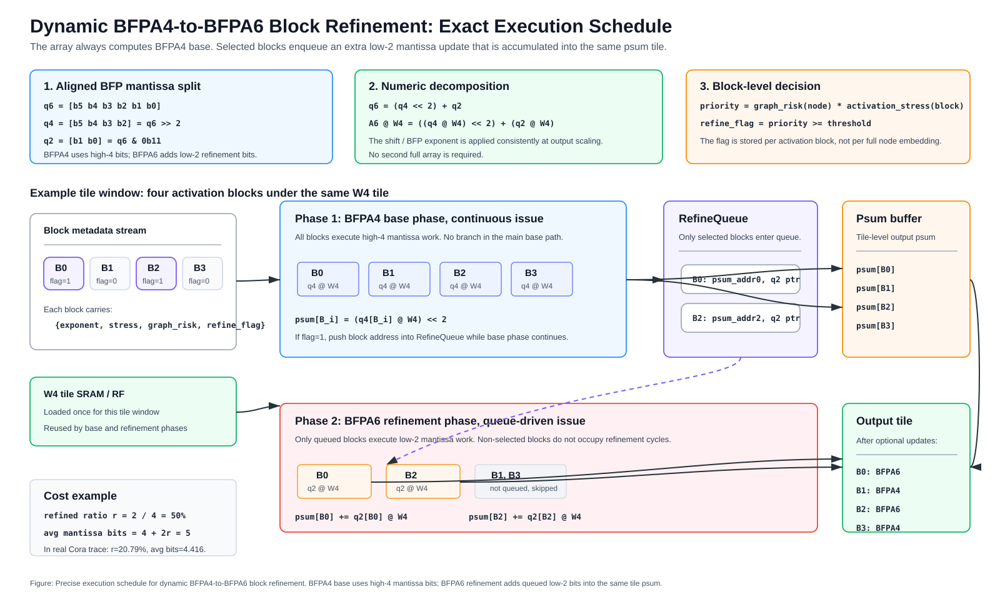
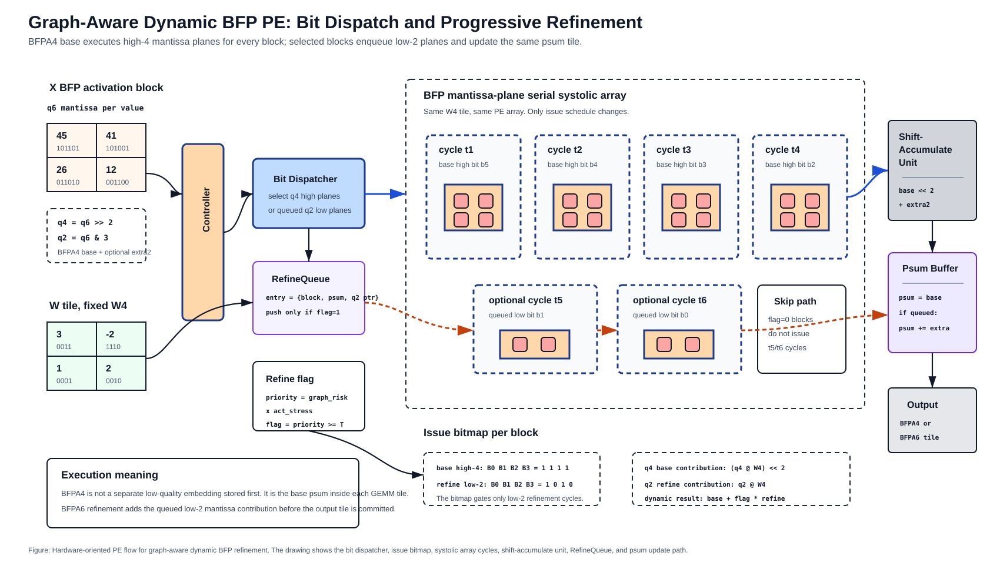

# Dynamic BFP Block Refinement Datapath

本文档说明 `BFPA4 base + optional BFPA6 refinement` 在硬件阵列内部如何执行。重点是 block-level `refine_flag`、partial-sum 追加、refinement queue 和两阶段调度。



The following PE-level execution figure expands the bit dispatcher, issue bitmap, systolic-array cycles, shift-accumulate unit, RefineQueue, and psum update path:



## 1. 目标

后端 miss-node encoder 不直接使用统一 W4A8，也不把所有节点固定成同一低位宽。当前主线采用：

```text
W:
    固定 AWQ W4

Activation:
    BFP shared exponent
    默认 BFPA4 mantissa
    只对 selected activation blocks 追加 BFPA6 extra mantissa bits
```

因此，一个 GEMM block 有两种执行状态：

```text
not refined:
    W4 x BFPA4

refined:
    W4 x BFPA4 + extra W4 x A_extra2
```

这里的 refinement 是 tile-level partial-sum correction，不是重跑完整 layer，也不是保存 BFPA4 embedding 后再改写 embedding。

## 2. Block Metadata

每个 activation block 对应一小段 metadata：

```text
BlockMeta:
    exponent      shared BFP exponent
    stress        activation stress from exponent selection
    graph_risk    node-level graph risk
    refine_flag   1 if this block needs BFPA6 refinement
```

`refine_flag` 由 block-level priority 产生：

```text
priority = graph_risk(node) * activation_stress(block)

if priority >= threshold:
    refine_flag = 1
else:
    refine_flag = 0
```

其中：

```text
graph_risk:
    来自图传播风险，目前主要使用 degree / propagation risk。

activation_stress:
    来自 BFP exponent selection 阶段，衡量一个 block 内 shared exponent 是否会压低小值精度。
```

最小必要 metadata 是：

```text
1-bit refine_flag per activation block
```

如果 block size 为 128 values，BFPA4 mantissa payload 是：

```text
128 values * 4 bits = 512 bits
```

则 `refine_flag` 本身的存储开销约为：

```text
1 / 512 ~= 0.2%
```

## 3. Mantissa Split

BFPA6 mantissa 可以拆成 high-4 base 和 low-2 refinement。这里采用对齐表示，使 BFPA4 是 BFPA6 的高 4 位近似：

```text
A6_mantissa = q6 = [b5 b4 b3 b2 b1 b0]

A4_base     = q4 = [b5 b4 b3 b2] = q6 >> 2
A2_extra    = q2 = [b1 b0]       = q6 & 0b11

q6 = (q4 << 2) + q2
```

GEMM 可以写成：

```text
Y = A * W

Y4      = (q4 * W4) << 2
DeltaY  = q2 * W4

Y_dyn =
    Y4                 if refine_flag = 0
    Y4 + DeltaY        if refine_flag = 1
```

所以 dynamic BFPA4-to-BFPA6 不需要两套完整阵列。阵列始终执行 W4 x mantissa 的乘加，只是 selected blocks 会额外发射 2-bit mantissa-plane cycles。

## 4. Naive Per-Block Branching

最直接的执行方式是：

```text
for each activation block:
    compute BFPA4 base
    if refine_flag:
        compute extra 2-bit refinement
```

例如：

```text
block0: refine
block1: no refine
block2: refine
block3: no refine
```

执行流为：

```text
block0: base4 + extra2
block1: base4
block2: base4 + extra2
block3: base4
```

这种方式逻辑简单，但 block 粒度的 `1/0/1/0` 分支会让主阵列控制流变碎，可能产生 issue bubble 和利用率下降。

## 5. Two-Phase Execution

更稳定的实现是两阶段执行：

```text
Phase 1: BFPA4 base phase
    所有 activation blocks 连续执行 BFPA4 base。

Phase 2: BFPA6 refinement phase
    只对 refine_flag = 1 的 blocks 追加 extra 2-bit contribution。
```

对上面的例子：

```text
base phase:
    block0 base4
    block1 base4
    block2 base4
    block3 base4

refine phase:
    block0 extra2
    block2 extra2
```

好处：

```text
1. BFPA4 base path 连续、规则。
2. selected blocks 被集中追加计算，减少主路径频繁切换。
3. refinement phase 的成本与 refined block ratio 成正比。
```

代价：

```text
1. 需要记录 selected block 的 psum address。
2. 需要小型 refinement queue。
3. psum buffer 需要支持后续追加更新。
```

## 6. Refinement Queue

两阶段执行可以用 `RefineQueue` 实现：

```text
RefineQueue entry:
    block_id
    psum_addr
    exponent
    A_extra2 pointer / packed bits
```

执行流程：

```text
for each W tile:
    load W4 tile into SRAM / RF

    for each activation block:
        compute BFPA4 base
        update psum buffer

        if refine_flag:
            push {block_id, psum_addr, exponent, A_extra2} into RefineQueue

    while RefineQueue not empty:
        pop selected block
        compute A_extra2 * W4
        add DeltaY into psum buffer

    write output tile
```

如果硬件资源允许，refinement lane 可以和 base lane 部分重叠：

```text
base lane:
    processes later BFPA4 blocks

refinement lane:
    processes earlier selected blocks from RefineQueue
```

这样 `refine_flag` 的不规则性被吸收到 queue 中，主 base array 不需要在每个 block 后停顿等待。

## 7. Partial-Sum Buffer

动态 refinement 保存的不是最终 embedding，而是 GEMM tile 的 partial sum。

```text
BFPA4 base:
    psum = A4_base * W4

optional refinement:
    psum += A2_extra * W4

output:
    write psum as output tile
```

因此需要：

```text
1. psum buffer:
   保存 output tile partial sums。

2. psum address table:
   让 RefineQueue entry 找回对应 block 的 psum location。

3. accumulate path:
   支持 extra2 contribution 加回已有 psum。
```

这个逻辑和普通 tiled GEMM 的 output-stationary / partial-sum accumulation 兼容，只是多了一次 optional update。

## 8. PE Datapath

PE 不需要切换成另一套 6-bit 阵列。它只需要支持两类 mantissa-plane issue：

```text
base issue:
    issue high-4 mantissa cycles

refine issue:
    issue low-2 mantissa cycles for selected blocks
```

简化 PE 数据流：

```text
                 W4 tile
                   |
                   v
        +----------------------+
A4 ---> | W4 x A_mantissa MAC  | ---> psum_base
        +----------------------+
                   ^
                   |
A2_extra ----------+  only if refine_flag = 1
```

计算模式：

```text
BFPA4:
    4 high mantissa-bit work units

BFPA6 refined block:
    4 high-bit base work units + 2 low-bit refinement work units
```

所以每个 refined block 的额外计算量相对 BFPA4 block 为：

```text
extra_compute_per_refined_block = 2 / 4 = 50%
```

但只对 selected blocks 生效。

## 9. Average Cost Model

若 refined block ratio 为 `r`：

```text
effective_bits = 4 + 2 * r
dynamic / BFPA4 compute ~= effective_bits / 4
dynamic / BFPA6 compute ~= effective_bits / 6
dynamic / BFPA8 compute ~= effective_bits / 8
```

例如 Cora 当前 dynamic pool：

```text
r = 20.79%

effective_bits = 4 + 2 * 0.2079 = 4.416

dynamic / BFPA4 ~= 4.416 / 4 = 1.104x
dynamic / BFPA6 ~= 4.416 / 6 = 0.736x
dynamic / BFPA8 ~= 4.416 / 8 = 0.552x
```

array trace 中观测到：

```text
refined blocks:          20.79%
effective mantissa bits: 4.416
dynamic / BFPA4 cycles:  1.102x
dynamic / BFPA6 cycles:  0.735x
dynamic / BFPA8 cycles:  0.551x
```

这说明当前 simulator 的 array activity 与 mantissa-bit cost model 基本一致。

## 10. Control Overhead

额外控制开销主要来自：

```text
1. refine_flag generation:
   priority compare。

2. queue push/pop:
   selected block 写入 / 读出 RefineQueue。

3. psum address lookup:
   找回 selected block 对应的 psum location。

4. optional psum update:
   extra2 contribution 加回 psum buffer。
```

其中 `refine_flag` 比较和 queue metadata 远小于 GEMM 本身。主要性能风险不是比较器面积，而是：

```text
selected blocks 分布过碎时，
refinement issue 可能造成调度不连续。
```

两阶段执行和 RefineQueue 的目的就是把这种不连续性从主 base path 中隔离出去。

## 11. Queue and Buffer Sizing

`RefineQueue` 和 `psum buffer` 都按 tile 级别配置，不按全图节点配置。因此它们的容量开销主要由 tile shape 和 refined block ratio 决定。

### 11.1 RefineQueue size

`RefineQueue` 不应保存完整 activation 或 embedding，只保存 selected block 的索引和地址信息：

```text
RefineQueue entry:
    block_id / local row id
    psum_addr
    exponent
    A_extra2 pointer
    flags
```

一个 entry 可以粗略估算为：

```text
block_id / local row id: 10-16 bit
psum_addr:              12-20 bit
exponent:                8 bit
flags:                   few bits

total:
    about 64 bit / entry
```

如果一个 tile window 中有 256 个 activation blocks，refine ratio 为 20%：

```text
selected entries ~= 256 * 20% = 51
queue storage    ~= 51 * 64 bit = 3264 bit ~= 0.4 KB
```

即使配置 128-entry queue：

```text
128 * 64 bit = 8192 bit = 1 KB
```

因此 `RefineQueue` 本身不是主要 SRAM 压力。关键约束是 queue 只存 pointer / address，不复制完整 activation block。

### 11.2 Extra2 staging buffer

如果 `A_extra2` 不只是用 pointer 回读，而是在本地暂存，则每个 block 需要：

```text
block_size = 128 values
extra bits = 2 bit / value

extra2 payload = 128 * 2 bit = 256 bit = 32 B / block
```

如果最多暂存 64 个 selected blocks：

```text
64 * 32 B = 2 KB
```

如果采用 pointer-based design，`extra2 staging buffer` 可以进一步减小，代价是 refinement phase 需要从局部 activation buffer 重新读取 extra2 bits。

### 11.3 Psum buffer size

`psum buffer` 是 tiled GEMM 本来就需要的 output partial-sum storage，不是 dynamic refinement 独有的结构。假设 output tile 为：

```text
M_tile x N_tile
```

例如：

```text
M_tile = 16 token rows
N_tile = 128 output channels
```

若 psum 使用 16-bit：

```text
16 * 128 * 16 bit = 32768 bit = 4 KB
```

若 psum 使用 32-bit：

```text
16 * 128 * 32 bit = 65536 bit = 8 KB
```

如果 `M_tile = 32`：

```text
32 * 128 * 16 bit = 8 KB
32 * 128 * 32 bit = 16 KB
```

因此第一版暂且使用：

```text
block size:       128 values
M_tile:           16 or 32 token rows
N_tile:           128 output channels
RefineQueue:      64 or 128 entries
psum buffer:      8-16 KB per array tile
extra2 staging:   0-4 KB depending on pointer vs copy design
```

### 11.4 Overflow handling

容量过大的风险主要来自：

```text
1. M_tile / N_tile 过大，导致 psum buffer 变大。
2. refine ratio 过高，导致 queue 长时间接近满。
3. queue 复制完整 activation，而不是保存 pointer / address。
```

硬件可以使用简单 backpressure 和 fallback：

```text
if RefineQueue almost full:
    temporarily execute selected block inline
    or reduce accepted refinement blocks in the current tile window
```

其中 inline execution 的含义是当前 block 在 base phase 后立即追加 extra2，而不是进入 queue。这样可以保证 correctness，不会因为 queue 满而丢失 refinement。

### 11.5 Storage takeaway

典型配置下，额外存储量级为：

```text
RefineQueue + metadata:
    about 1-2 KB

extra2 staging:
    about 0-4 KB

psum buffer:
    reused from tiled GEMM output accumulation, about 8-16 KB per array tile
```

所以 dynamic BFPA4-to-BFPA6 refinement 的新增存储主要是 KB 级 queue / metadata。更大的 `psum buffer` 属于 GEMM tile 本身必需的 partial-sum storage，dynamic refinement 只是复用它进行 optional update。

## 12. End-to-End Placement

Dynamic BFP refinement 只处理 miss nodes：

```text
SimHash / CAM frontend:
    direct hit      -> embedding cache read
    fuzzy hit       -> residual-gate correction
    miss / reject   -> BFP encoder

BFP encoder:
    BFPA4 base for all miss-node activation blocks
    optional BFPA6 refinement for selected blocks
```

这使得前端 reuse 和后端 refinement 分工明确：

```text
reuse/residual:
    减少进入 encoder 的节点数量。

dynamic BFP:
    降低剩余 miss-node encoder 的执行成本。
```

## 14. Summary

Dynamic BFPA4-to-BFPA6 refinement 的具体实现是：

```text
1. 每个 activation block 产生 refine_flag。
2. 阵列连续执行 BFPA4 base。
3. selected blocks 被写入 RefineQueue。
4. refinement phase 对 selected blocks 追加 low-2 mantissa x W4。
5. extra contribution 加回 tile-level psum buffer。
6. 最终输出 tile，不保存或重写整层 embedding。
```

核心优势是：

```text
BFPA4 提供低成本 base path；
BFPA6 refinement 只对 graph-risk x activation-stress 高的 blocks 追加；
两阶段执行避免主阵列在 block 间频繁切换；
RefineQueue 把不规则 selected blocks 转化为可调度的 extra2 workload。
```
