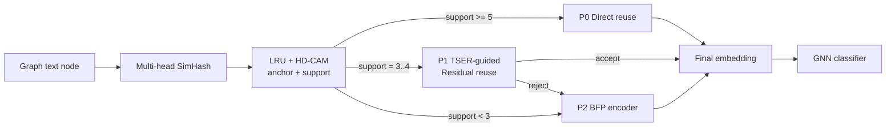

# Graph-Aware BFP NPU Design

本文档是当前后端 NPU 主线入口。主线已经收束为：

```text
SimHash/LRU-CAM:
    找可复用 anchor，减少 encoder 调用次数。

TSER-guided residual reuse:
    用图传播风险和语义风险控制 fuzzy reuse，并用轻量 MLP 修正中风险 fuzzy hit。

TSER / graph-risk-guided BFP encoder:
    对 reject / miss nodes，用 BFPA4 作为低成本底座，只把高风险节点提升到 BFPA6。
```

因此 TSER 不是只服务前端 reuse。它是贯穿前后端的风险信号：

```text
front-end:
    判断 fuzzy anchor 是否安全。

backend:
    判断 miss node 是否需要更高 activation precision。
```

---

## 1. End-to-End Path



当前主线参数：

```text
SimHash:
    8 heads x 16 bits
    radius = 2

Score gate:
    T = 31
    TSER weights = 3 / 1 / 1
        propagation risk
        graph context risk
        low-unique risk

Support split:
    support >= 5  -> direct reuse
    support = 3..4 -> residual candidate
    support < 3   -> BFP encoder
```

---

## 2. TSER-Guided Residual Reuse

CAM 只回答“有没有相似 anchor”。TSER 回答“这个相似 anchor 复用错了后果大不大”。

```text
reuse_risk = sensitivity_q * reuse_error_q

sensitivity_q =
    3 * propagation_q
  + 1 * graph_context_q
  + 1 * low_unique_q
```

进入 residual 路径后，轻量 MLP 做两件事：

```text
delta, accept_score = MLP(pair_feature(v, u))

if accept_score >= tau:
    E_hat(v) = E(u) + alpha * delta
else:
    reject -> BFP encoder
```

这里 `E(u)` 是缓存里的 anchor embedding。`delta` 学的是当前目标 embedding 空间里的修正量，所以 ST、LLaMA、BFPA4、BFPA6 都需要各自训练 residual adapter/gate。

当前 Cora/LLaMA BFPA target 结果：

| Target | Direct Reuse | Direct Drop | SoftDirect Reuse | SoftDirect Drop | Residual Reuse | Residual Drop |
|---|---:|---:|---:|---:|---:|---:|
| BFPA6 | 15.7% | 0.71% | 51.6% | 2.56% | 39.1% | 1.24% |
| BFPA4 | 15.7% | 0.42% | 50.3% | 2.80% | 38.5% | 1.74% |

含义：

```text
SoftDirectReuse:
    把 support=3..4 的 fuzzy hit 全收，reuse 高但 drop 增大。

ResidualReuse:
    只接受 gate 认为可靠的 fuzzy hit，reuse 降低但 drop 回到 2% 内。
```

---

## 3. BFP Encoder Path For Miss Nodes

Residual gate 拒绝的节点和 CAM miss 节点仍然要运行 LLaMA encoder。当前后端主线采用 BFP activation format：

```text
W:
    仍然沿用 W4 / AWQ weight path。

A:
    使用 BFP activation。
    一个 block 共享 exponent，每个 value 存 mantissa。
```

默认低成本路径：

```text
BFPA4:
    4-bit mantissa + shared block exponent
```

高风险 refinement：

```text
top-risk nodes -> BFPA6
low-risk nodes -> BFPA4
```

BFP 的价值在于：它不是普通 INT4 activation。Shared exponent 保留了 block 的动态范围，因此 BFPA4 比普通 W4A4 更稳。

---

## 4. Graph-Aware BFP Refinement

后端不把所有 miss nodes 都用同一精度。它使用 TSER / Degree 作为 selector：

```text
default:
    BFPA4

refinement:
    top risk x% -> BFPA6
```

当前观察：

```text
Cora:
    TSER 比 Degree 更强。
    说明图语义风险能更好保护敏感节点。

PubMed:
    Degree 更稳定。
    说明同质图上 degree / propagation risk 是更强的硬件友好 proxy。
```

推荐主表配置：

| Dataset | BFP Policy | Selector | Cost | Drop |
|---|---|---|---:|---:|
| Cora | 30% BFPA6 + 70% BFPA4 | TSER | 0.319 | 0.49% |
| PubMed | 30% BFPA6 + 70% BFPA4 | Degree | 0.319 | 0.54% |

更完整结果见：

```text
docs/archive/results/GRAPH_BFP_PROGRESSIVE_REFINEMENT_RESULT.md
```

---

## 5. W-Stationary Dataflow

BFP encoder 仍然执行 Transformer GEMM：

```text
Y = X @ W
```

其中 `W` 是所有节点共享的模型权重。NPU 不假设整层权重常驻片上，而是让一个 W tile 留在片上，连续服务更多 token rows：

```text
for each W tile:
    load W tile into SRAM / RF
    stream token rows from selected miss-node bucket
    compute X_tile @ W_tile
    evict W tile
```

一个具体量级：

```text
128 x 128 W4 tile:
    128 * 128 * 4 bit = 8 KB

4096 x 4096 W4 matrix:
    about 8 MB

4096 x 11008 W4 matrix:
    about 22 MB
```

所以硬件目标不是把整层 W 放片上，而是：

```text
keep reusable W tile on chip
stream selected token rows through it
avoid unnecessary W tile reloads
```

这借鉴了 FlashAttention 的 IO-aware 原则，但作用对象不同：

```text
FlashAttention:
    面向 attention Q/K/V tile。

Graph-aware BFP encoder:
    面向 LLaMA Linear/FFN W tile。
    图风险决定哪些 miss-node token rows 进入同一执行流。
```

---

## 6. Explored But Not Mainline

以下路径已经探索过，但不作为当前主贡献：

```text
Partial-depth encoder:
    直接用 L4/L8/L16 hidden state 当 final embedding，掉点过大。

Cross-row BFP block packing:
    rowwise BFPA4 较稳，cross-row BFPA4 全层使用过激。

Prediction-free bit-plane early stop:
    思路有价值，但当前 bound validation 不够稳。
    暂时不作为主线 NPU 贡献。

FFN channel gating / token compaction:
    可作为历史探索，不作为当前论文主路径。
```

---

## 7. Current Contribution Boundary

不要把贡献写成：

```text
degree selects precision
```

当前更准确的贡献边界是：

```text
1. SimHash/LRU-CAM avoids many encoder calls.
2. TSER-guided residual reuse turns fuzzy hit into controllable reuse.
3. TSER / graph-risk-guided BFP refinement reduces cost for remaining miss-node encoder execution.
```

这条主线的关键不是单个 BFP 格式本身，而是：

```text
graph task risk controls both reuse safety and miss-node encoder precision.
```

---

## 8. Related Documents

```text
docs/core/SCORE_DEFINITIONS.md
docs/core/CAM设计.md
docs/core/RESIDUAL_CORRECTED_REUSE.md
docs/results/FINAL_BFP_VALIDATION_RESULT.md
docs/results/UNIFIED_FRONTEND_POLICY_RESULT.md
docs/npu/GRAPH_AWARE_DYNAMIC_BFP_REFINEMENT_NPU.md
docs/npu/PROGRESSIVE_BFP_ARRAY_DESIGN_AND_EXPERIMENTS.md
```
