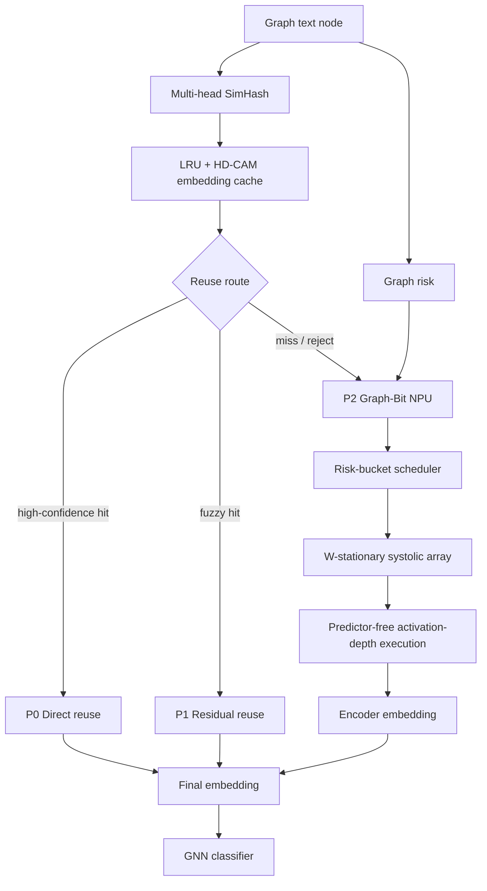

# Graph-Bit NPU Design

本文档是 Graph-Bit NPU 的主设计入口，只保留核心机制：

```text
SimHash 前端复用
LRU + HD-CAM embedding cache
Graph-Bit NPU
类 FlashAttention 的 W-stationary 数据流
```

实验命令和结果表见：

```text
docs/npu/GRAPH_BIT_FULLSTACK_REPRODUCTION_GUIDE.md
docs/results/
```

---

## 1. One-Sentence Idea

Graph-Bit 的目标不是简单做 degree-guided quantization，而是把图任务信息接入 LLM encoder 的执行层级：

```text
SimHash/CAM decides whether to run the encoder.
Graph risk decides how remaining miss nodes are scheduled and how much arithmetic effort they spend inside the NPU.
```

---

## 2. System Overview



三条路径：

| Path | Meaning | Main Cost |
|---|---|---:|
| P0 Direct reuse | CAM 高置信命中，直接读缓存 embedding | near-zero |
| P1 Residual reuse | CAM fuzzy hit，anchor embedding + residual adapter | tiny |
| P2 Graph-Bit NPU | miss/reject 节点执行 encoder GEMM | NPU cost |

---

## 3. SimHash Front-End

每个节点生成多个短 hash head：

```text
8 heads x 16 bit
```

hash 由文本和图上下文共同产生：

```text
self text feature
neighbor / graph context
optional structural feature
```

多头设计的作用：

```text
1. 每个 CAM bank 只需要比较短 word。
2. 多个 head 的 support count 可作为置信度。
3. support count 自然划分 direct / residual / compute。
```

---

## 4. LRU + HD-CAM Embedding Cache

### 4.1 Cache Organization

```text
Embedding Cache entry:
    hash heads
    node_id
    cached embedding
    metadata
    LRU age

HD-CAM banks:
    bank0 -> head0
    bank1 -> head1
    ...
    bank7 -> head7
```

### 4.2 Lookup Flow

```text
1. Query node computes 8 hash heads.
2. 8 HD-CAM banks search in parallel.
3. Each bank returns candidates with Hamming distance <= R.
4. Candidates are merged by node_id.
5. support count + score gate decide route.
```

### 4.3 LRU Role

CAM 解决“找谁像我”，LRU 解决“cache 满了保留谁”。

```text
hit:
    update LRU age

new computed embedding:
    insert into cache

cache full:
    evict least recently used entry
```

最小硬件版本只需要：

```text
HD-CAM lookup + LRU embedding cache
```

后续可以扩展为 graph-aware replacement，但不是主线必要条件。

---

## 5. Reuse Decision

CAM 输出候选和 support，不直接输出 embedding 是否可用。

```text
support high:
    direct reuse

support medium:
    residual-corrected reuse

support low:
    send to Graph-Bit NPU
```

语义：

```text
direct reuse:
    cached embedding is trusted.

residual reuse:
    cached anchor is close but needs correction.

compute:
    candidate is not reliable enough; run encoder.
```

---

## 6. Graph-Bit NPU Input

Graph-Bit NPU 只处理前端没有安全复用的 miss nodes。

```text
Input queue:
    node_id
    tokenized text
    graph risk score
    route metadata
```

Graph risk 当前主线优先使用 deployable 的 degree / propagation risk：

```text
high propagation risk:
    more conservative execution

low propagation risk:
    more aggressive early stop / batching
```

TSER / context / low-unique score 保留为消融和修正项。

---

## 7. Predictor-Free Activation-Depth Execution

Graph-Bit 不使用 learned predictor，也不使用 oracle error。它使用数值上界判断低位 activation effort 是否还值得继续。

activation 逻辑上是 A8：

```text
A8 = b7 b6 b5 b4 b3 b2 b1 b0
```

bit-serial datapath 从高位到低位执行：

```text
P8: b7..b0
P7: b7..b1
P6: b7..b2
P5: b7..b3
P4: b7..b4
```

运行时决策：

```text
graph risk -> min_depth, tolerance

for depth in min_depth..8:
    if remaining_low_bit_bound(depth) <= tolerance(node):
        stop at depth
        break
```

关键点：

```text
Degree / graph risk does not directly assign a fixed P8/P6/P4 ratio.
It controls min_depth and tolerance.
The runtime bound decides the actual stop depth.
```

主要节省：

```text
PE bit-serial MAC activity
W RF / broadcast activity for skipped low-bit cycles
partial-sum read / update / write
activation-side issue activity
```

---

## 8. W-Stationary Systolic Dataflow

Graph-Bit 的主要数据流收益来自 W tile reuse。

LLaMA encoder 的 Linear / FFN 都是：

```text
Y = X @ W
```

其中：

```text
W:
    model weights, shared by all nodes and token rows

X:
    token rows from current miss-node bucket
```

数据流：

```text
for each layer:
    for each GEMM:
        for each W tile:
            load W tile once into SRAM/RF
            stream token rows from risk bucket
            execute bit-serial GEMM
            evict W tile
```

阵列视图：

```text
          X token rows
              |
              v
        +------------+
W tile  | PE PE PE PE|  -> output tile
stay -> | PE PE PE PE|
        | PE PE PE PE|
        +------------+
```

这里借鉴的是 FlashAttention 的 IO-aware 思路：

```text
keep reusable tile on chip
stream consumers through it
avoid repeated HBM reload
```

区别是：

```text
FlashAttention:
    keeps Q/K/V attention tiles on chip.

Graph-Bit:
    keeps Linear/FFN W tiles on chip,
    and uses graph risk to decide which token rows should consume the tile together.
```

---

## 9. Risk-Bucket Scheduler

如果不同风险节点混在一个 micro-batch，低风险节点可能被高风险节点拖到保守执行。

Graph-Bit scheduler 做两件事：

```text
1. group miss nodes by graph risk / stop-depth tendency
2. make each W tile serve more same-risk token rows before eviction
```

执行：

```text
miss nodes
    -> risk tagging
    -> bucket queues
    -> W-stationary tile execution
```

bucket size 表示 W tile 的 service window，不是 bit-width：

```text
b16: W tile serves 16 token-row blocks
b32: W tile serves 32 token-row blocks
b64: W tile serves 64 token-row blocks
```

tradeoff：

```text
larger bucket:
    fewer W tile reloads
    better traffic/cycle reduction
    higher SRAM pressure and tail handling cost

smaller bucket:
    easier scheduling
    lower SRAM pressure
    weaker W reuse
```

---

## 10. What Is New

Graph-Bit does not claim ordinary W tile reuse is new. Ordinary GEMM accelerators already reuse W tiles.

The new point is:

```text
Graph information changes the encoder execution order.
```

Specifically:

```text
1. SimHash/CAM removes many nodes before encoder execution.
2. Residual reuse handles fuzzy hits without full encoder.
3. Miss nodes carry graph risk metadata.
4. Graph risk forms bucketed token-row streams.
5. Bucketed streams improve W-stationary reuse.
6. Graph risk also controls predictor-free activation-depth tolerance.
```

This is different from:

```text
generic Transformer accelerator:
    sees only tensor shapes

Graph-Bit:
    sees graph risk, reuse route, support count, and miss-node bucket
```

---

## 11. Contribution Boundary

Do not frame the contribution as:

```text
degree tells the model to use lower precision
```

Frame it as:

```text
Graph-aware encoder execution hierarchy:
    CAM/cache reuse avoids encoder calls.
    Residual reuse repairs fuzzy anchors.
    Graph-Bit NPU schedules remaining encoder GEMMs by graph risk.
    Predictor-free bound controls activation effort inside the datapath.
```

---

## 12. Related Documents

```text
docs/core/CAM设计.md
    HD-CAM / SimHash front-end.

docs/core/RESIDUAL_CORRECTED_REUSE.md
    Residual reuse path.

docs/npu/GRAPH_BIT_SYSTOLIC_FLASH_DATAFLOW.md
    Systolic + FlashAttention-style W-stationary dataflow.

docs/npu/GRAPH_BIT_EARLY_STOP_IMPLEMENTATION.md
    Predictor-free early-stop implementation path.

docs/npu/GRAPH_BIT_FULLSTACK_REPRODUCTION_GUIDE.md
    How to reproduce and tune experiments.

docs/npu/LLAMA_ROOFLINE_PROFILE.md
    LLaMA GEMM roofline analysis.
```
