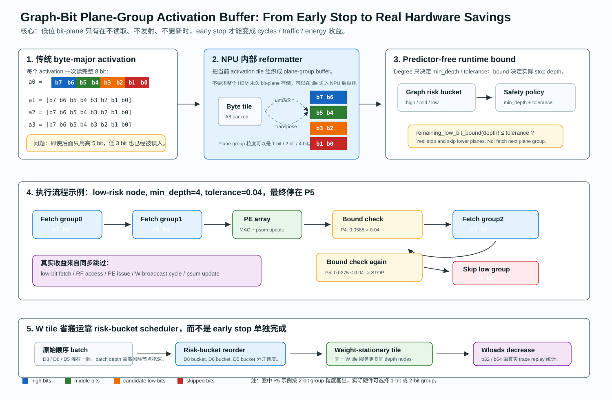

# Graph-Bit Predictor-Free Early Stop and W-Tile Reuse

本文档专门解释 Graph-Bit 中最容易被误解的两部分：

```text
1. predictor-free bit-plane early stop 到底如何决定 stop depth
2. W tile 搬运/复用到底如何减少，以及 b32/b64 的 tradeoff
```

本文档不替代复现指南。复现实验命令见：

```text
docs/npu/GRAPH_BIT_FULLSTACK_REPRODUCTION_GUIDE.md
```

Degree 如何具体映射到 `min_depth / tolerance / stop_depth` 见：

```text
docs/npu/GRAPH_BIT_DEGREE_BOUND_POLICY.md
```

## 0. 全流程图

下图把 `byte-major activation -> plane-group buffer -> predictor-free bound -> PE issue -> risk-bucket W tile reuse` 串成一个完整流程：



图里的关键路径是：

```text
1. 传统 byte-major:
   一次读完整 A8 byte，低位已经被搬入，early stop 很难减少 activation traffic。

2. plane-group buffer:
   NPU 内部把 activation tile 重排成 b7/b6、b5/b4、b3/b2、b1/b0 等 plane group。

3. predictor-free bound:
   graph risk 给出 min_depth/tolerance；
   runtime bound 判断剩余低位贡献是否足够小。

4. stop:
   若 bound 满足，后续低位 group 不再 fetch、不进 RF、不发射 PE、不更新 psum。

5. risk-bucket scheduler:
   miss nodes 按 stop-depth 分桶，让同一 W tile 服务更多同 depth 节点，减少 Wloads。
```

## 1. 当前方案的边界

Graph-Bit 当前采用两阶段验证：

```text
Accuracy validation:
    用 W4A8 / W4A6 / W4A5 / W4A4 embedding pools 近似 P8/P6/P5/P4 stop depth。

Hardware validation:
    用 ONNXim component simulation + per-node stop-depth trace + scheduler replay
    估计 cycles / traffic / energy。
```

这两件事要分开理解：

```text
W4A6 / W4A5 pools:
    是 accuracy proxy，用来验证“如果节点有效 activation depth 较低，GNN 精度是否还能接受”。

runtime bit-plane early stop:
    是硬件执行机制，用来减少 activation bit-plane fetch / issue / psum update，
    并通过 risk-bucket scheduler 放大 W tile reuse。
```

目前没有全量逐节点、逐层、逐 GEMM 重新跑完整 LLaMA encoder 生成 bit-plane early-stop embedding。这个方向工程量很大，当前只建议做小样本 sanity check。

## 2. Predictor-Free Early Stop

### 2.1 它不是 learned predictor

这里的 predictor-free 指：

```text
不训练一个模型去预测节点会不会出错；
不使用 FP embedding 和 quant embedding 的 oracle 差值；
只用 runtime partial sum 和剩余低位 bit 的上界判断是否可以停止。
```

Graph risk 只提供两个控制量：

```text
min_depth:
    该风险等级至少要执行到几 bit。

tolerance:
    剩余低位 bit-plane 的最大可能贡献小到什么程度才允许停止。
```

当前默认配置：

```text
high-risk:
    min_depth = 8
    tolerance = 0.00
    基本完整 P8

mid-risk:
    min_depth = 6
    tolerance = 0.02
    常见停在 P6

low-risk:
    min_depth = 4
    tolerance = 0.04
    当前常见停在 P5
```

### 2.2 Runtime 判断流程

对一个 miss node batch，NPU 以 bit-plane 顺序执行 activation：

```text
A8 = b7 b6 b5 b4 b3 b2 b1 b0
```

执行流程：

```text
for depth in min_depth..8:
    execute high-bit planes needed for this depth
    estimate remaining_low_bit_bound(depth)

    if remaining_low_bit_bound(depth) <= tolerance:
        stop at depth
        skip lower bit-planes
        break
```

因此 Degree / TSER / Context 不直接决定最终 P8/P6/P5/P4。它们只决定：

```text
risk bucket -> min_depth + tolerance
runtime bound -> actual stop depth
```

这点和静态 degree-guided precision 不同。

### 2.3 Bound 的直觉

低位 bit-plane 对最终 GEMM partial sum 的影响有上界。执行到 depth 后，剩余低位的理论贡献越小，越可以停止。

概念上：

```text
remaining_low_bit_bound(depth)
    ~= remaining_activation_low_bits(depth) * weight_abs_bound * tile_scale
```

其中：

```text
remaining_activation_low_bits(depth):
    未执行的低位 bit-plane 的最大可能数值贡献。

weight_abs_bound:
    当前 W tile 的权重绝对值统计，可以用 mean/max 或硬件保守界。

tile_scale:
    K tile 长度、量化 scale 和累加范围带来的归一化系数。
```

这里使用的是上界，不是 learned predictor。保守性由 `tolerance` 和 `weight_abs_bound` 控制。

## 3. Bit-Plane Early Stop 真正省什么

### 3.1 不改 layout 时只能省一部分

如果 activation 仍按普通 byte-major 格式读取：

```text
A_byte = [b7 b6 b5 b4 b3 b2 b1 b0]
```

那么一旦从存储层读入 byte，低位 bit 已经被读进来了。此时 early stop 只能主要减少：

```text
bit-plane issue cycles
低位 MAC
低位 psum read/update/write
部分 RF / broadcast activity
```

但不一定减少第一次 activation byte read。

### 3.2 plane-group activation buffer

为了让 early stop 真正减少 activation traffic，需要在 NPU 内部使用 plane-group / bit-plane-major buffer：

```text
Plane group 0: b7 b6
Plane group 1: b5 b4
Plane group 2: b3 b2
Plane group 3: b1 b0
```

如果某个节点在 P5/P6 附近停止，就不再 fetch 后续低位 plane group。

注意：这不一定要求外部 HBM 永久按 bit-plane-major 存储。更现实的做法是：

```text
HBM / upstream:
    可以仍然是 byte-major 或 layer output format。

NPU tile buffer:
    在进入 bit-serial GEMM 前，把当前 activation tile 组织成 plane-group layout。

后续 low-bit plane group:
    如果 bound 满足，就不进入 issue queue / RF / psum update。
```

tradeoff：

```text
优点:
    low-bit plane 不再占 issue cycles 和片上访问；
    如果 activation intermediate 由上一层直接写入片上 buffer，也能减少下一步读低位 plane。

代价:
    需要 bit-plane pack/unpack 或 tile buffer 重排；
    buffer bank 要支持 plane-group 访问；
    对小 batch 或 low reuse 情况，收益可能被固定开销稀释。
```

### 3.3 W 不能因为 A 低位停止而完全消失

activation 停在 P5/P6 并不代表 W tile 不需要。高位 activation 仍然要乘同一块 W。

所以 early stop 本身主要减少：

```text
低位 A-plane 的 issue
低位 A-plane 对应的 W RF/broadcast 周期
低位 partial-sum update
```

它通常不直接减少 HBM 级 W tile 读取。

要减少 W HBM 读取，需要配合 risk-bucket weight-stationary scheduling。

## 4. W Tile Reuse 如何减少搬运

### 4.1 普通 weight-stationary reuse 不是新东西

前人的 Transformer/NPU accelerator 都知道：

```text
同一个 W tile 服务越多 activation rows，W tile 的 HBM load 越能摊薄。
```

所以 Graph-Bit 不能把贡献写成“发现 W tile 可以复用”。

Graph-Bit 的新点是：

```text
graph risk / stop-depth trace 让 miss nodes 可以按执行深度分桶，
从而让 bit-serial early stop 和 weight-stationary dataflow 协同。
```

也就是说：

```text
普通 Transformer:
    batch 通常按输入顺序或服务请求组织。

Graph-Bit:
    miss nodes 有真实 graph risk / stop-depth 标签，
    可以重排成 D8 / D6 / D5 / D4 bucket，
    同一 W tile 在一个 bucket 内服务更多相同执行深度的节点。
```

### 4.2 为什么 mixed-depth batch 会浪费

如果一个 micro-batch 混有 high-risk 和 low-risk 节点：

```text
node A: D8
node B: D5
node C: D5
node D: D6
```

在 SIMD/systolic array 批执行中，低风险节点可能被高风险节点拖到更深执行：

```text
batch effective depth = max(D8, D5, D5, D6) = D8
```

这会浪费低风险节点本来可以跳过的低位 bit-plane。

risk-bucket scheduler 的作用是：

```text
D8 nodes -> D8 bucket
D6 nodes -> D6 bucket
D5 nodes -> D5 bucket
D4 nodes -> D4 bucket
```

这样低风险 bucket 不被高风险节点拖慢。

### 4.3 Wloads 如何计算

当前 replay 使用真实 node trace。每个 miss node 有：

```text
node_id
route: miss
stop_depth: 8 / 6 / 5 / 4
depth_bucket: p8 / p6 / p5 / p4
```

baseline：

```text
baseline_tile_batch = 16
miss_nodes = N
baseline_Wloads = ceil(N / 16)
```

risk-bucket scheduler：

```text
candidate_batch = B
N8 = number of D8 miss nodes
N6 = number of D6 miss nodes
N5 = number of D5 miss nodes
N4 = number of D4 miss nodes

bucket_Wloads =
    ceil(N8 / B)
  + ceil(N6 / B)
  + ceil(N5 / B)
  + ceil(N4 / B)

Wscale = bucket_Wloads / baseline_Wloads
```

当前 Cora trace 例子：

```text
miss nodes = 1954
baseline_tile_batch = 16
baseline_Wloads = ceil(1954 / 16) = 123

RiskBucket-b32:
    Wloads = 63
    Wscale = 63 / 123 = 0.512

RiskBucket-b64:
    Wloads = 33
    Wscale = 33 / 123 = 0.268
```

这不是“凭空把 W traffic 乘 0.25”。`Wloads` 来自真实 trace 的 stop-depth 分桶和 candidate batch replay。

### 4.4 b32 / b64 的 tradeoff

`b32` 和 `b64` 表示 risk bucket 内 weight-stationary tile batch 的候选大小：

```text
b32:
    每次 W tile load 服务最多 32 个同 depth/risk 节点。

b64:
    每次 W tile load 服务最多 64 个同 depth/risk 节点。
```

batch 越大：

```text
Wloads 更少
W HBM traffic 更低
cycles / traffic / energy 更低
```

但代价是：

```text
需要更大的 activation / psum / output buffer
需要 bucket 内有足够节点填满 batch
调度等待时间可能增加
尾部不满导致 tail utilization 下降
小图或高 reuse 场景下收益会变小
```

因此：

```text
b32:
    更保守，更容易落地。

b64:
    更激进，吞吐更好，但更依赖 SRAM 和 bucket size。
```

论文主线建议优先报告 b32，b64 作为 sensitivity / upper feasible point。

## 5. W Tile Reuse 落到 cycles 里怎么体现

当前 trace replay 不是 full-system cycle-accurate simulator。它的计算流程是：

```text
1. ONNXim 跑代表性 LLaMA GEMM component
   full_p8
   p8_now / p6_now / p5_now / p4_now
   p8_ws_b32 / p6_ws_b32 / ...

2. residual_precision_depth 导出真实 per-node trace
   direct / residual / miss
   miss node stop_depth

3. replay_graphbit_trace_scheduler.py 重放调度
   原始顺序
   risk-bucket order
   b32 / b64

4. 根据 stop-depth histogram 和 Wloads
   从 ONNXim component lookup 组合 cycles / traffic / energy
```

代码入口：

```text
GraphhopSimhash/scripts/replay_graphbit_trace_scheduler.py
GraphhopSimhash/scripts/onnxim_graphbit_microbench.py
```

关键字段：

```text
Cycles:
    相对所有节点跑 FullP8 encoder 的归一化 cycles。

Traffic:
    DRAM read/write requests 的归一化 proxy。

Energy:
    当前为 0.5 * Cycles + 0.5 * Traffic 的 proxy。

AvgDepth:
    miss nodes 的平均 stop depth。

Wloads:
    trace replay 统计出的 W tile load 次数。

Wscale:
    Wloads / baseline_Wloads。
```

## 6. 当前结果怎么解释

Cora h8_54_T40 当前 trace-driven replay：

| Method | Reuse | Miss | Cycles | Traffic | Energy | Drop | AvgDepth | Wloads | Wscale |
|---|---:|---:|---:|---:|---:|---:|---:|---:|---:|
| FullP8-miss | 27.8% | 72.2% | 0.722 | 0.722 | 0.722 | 0.77% | 8.00 | 123 | 1.000 |
| GraphBit-now | 27.8% | 72.1% | 0.716 | 0.719 | 0.717 | 2.13% | 6.10 | 123 | 1.000 |
| FullP8-bucket-b32 | 27.8% | 72.2% | 0.385 | 0.368 | 0.377 | 0.77% | 8.00 | 62 | 0.504 |
| RiskBucket-b32 | 27.8% | 72.1% | 0.384 | 0.366 | 0.375 | 2.13% | 6.10 | 63 | 0.512 |
| FullP8-bucket-b64 | 27.8% | 72.2% | 0.290 | 0.191 | 0.241 | 0.77% | 8.00 | 31 | 0.252 |
| RiskBucket-b64 | 27.8% | 72.1% | 0.289 | 0.189 | 0.239 | 2.13% | 6.10 | 33 | 0.268 |

解释：

```text
FullP8-miss:
    reuse/residual 前端固定，miss 全部 P8。

GraphBit-now:
    early stop 已经把 AvgDepth 从 8.00 降到 6.10，
    但 Wloads 不变，所以 cycles 只小幅下降。

FullP8-bucket-b32/b64:
    miss nodes 仍完整 P8，但使用更大的 W-stationary service window。
    这行隔离出 W tile batching 本身的收益。

RiskBucket-b32:
    在 GraphBit-now 基础上，按 stop-depth 分桶调度，
    Wloads 从 123 降到 63。

RiskBucket-b64:
    更大的 bucket batch，Wloads 从 123 降到 33。
```

核心结论：

```text
当前 trace 下，W-stationary bucket batching 是主要 cycles / traffic 收益来源；
predictor-free mixed depth 把 AvgDepth 降低，但相对 FullP8-bucket 的额外 cycles 收益很小；
mixed depth 应定位为片上算术/能耗优化，需要继续用 RF、psum、PE 活动模型证明额外收益。
```

进一步的 bit-depth-sensitive activity breakdown 显示：

| Compare | ONNX-C Save | Activity-C Save | Activity-E Save | PE/W_RF/Psum Save | Extra Drop |
|---|---:|---:|---:|---:|---:|
| RiskBucket-b32 vs FullP8-bucket-b32 | 0.1% | 12.1% | 15.6% | 23.7% | +1.36% |
| RiskBucket-b64 vs FullP8-bucket-b64 | 0.3% | 13.9% | 16.8% | 23.7% | +1.36% |

这个结果给出更准确的定位：

```text
W-stationary bucket batching:
    负责主要 latency / traffic 收益。

predictor-free mixed depth:
    负责减少 A_RF / PE / W_RF / Psum 等片上活动。
    当前更适合作为能耗优化，而不是主要 cycles 优化。
```

脚本入口：

```bash
python GraphhopSimhash/scripts/model_graphbit_activity_breakdown.py \
  --replay-json output/.../replay/cora_seed42_DegBound_trace_replay.json \
  --output-dir output/.../activity_breakdown
```

## 7. Cycles 为什么对 P8/P6/P5 不敏感

当前 ONNXim component 结果里，`p8_ws_b32 / p6_ws_b32 / p5_ws_b32` 的 wall cycles 很接近：

| Case | ONNX Cycles / P8 | Effective Compute / P8 | PE Critical / P8 | W Read / P8 | A Read / P8 |
|---|---:|---:|---:|---:|---:|
| now P6 | 0.989 | 0.752 | 0.750 | 1.000 | 0.750 |
| now P5 | 0.989 | 0.626 | 0.625 | 1.000 | 0.750 |
| ws_b32 P6 | 0.999 | 0.752 | 0.750 | 1.000 | 0.750 |
| ws_b32 P5 | 0.998 | 0.626 | 0.625 | 1.000 | 0.750 |
| ws_b64 P6 | 0.997 | 0.752 | 0.750 | 1.000 | 0.750 |
| ws_b64 P5 | 0.996 | 0.626 | 0.625 | 1.000 | 0.750 |

这说明两件事：

```text
1. bit-serial compute 本身已经按 depth 缩小。
   Effective Compute / P8 从 P8 的 1.0 降到 P6 的约 0.75、P5 的约 0.63。

2. 但 ONNXim wall cycles 基本没跟着降。
   当前暴露出来的 critical path 仍然是 memory / pipeline / fixed path，
   saved bit-plane work 被 overlap 掩盖了。
```

因此不能直接把 `Effective Compute / P8` 当作 latency speedup。更准确的结论是：

```text
当前组件模型下：
    mixed-depth 明确减少 bit-op / PE / RF / psum 活动；
    但只有当 memory path 被 W tile reuse / bandwidth / overlap 进一步压低时，
    A-depth 才会变成明显 latency 收益。
```

### 7.1 Roofline sensitivity

为排查这个问题，新增了 cycles sensitivity 诊断：

```bash
python GraphhopSimhash/scripts/diagnose_graphbit_cycle_sensitivity.py \
  --component-root output/onnxim_graphbit/risk_bucket_components_s8 \
  --output-dir output/onnxim_graphbit/cycle_sensitivity
```

输出文件：

```text
output/onnxim_graphbit/cycle_sensitivity/cycle_sensitivity.txt
output/onnxim_graphbit/cycle_sensitivity/measured_components.tsv
output/onnxim_graphbit/cycle_sensitivity/roofline_sensitivity.tsv
```

关键结果：

```text
ws_b32:
    memory path 仍保持当前水平时，P6/P5 latency save 约 0。
    memory path 压到约 15% 以下后，P6/P5 开始出现 20%+ latency save。

ws_b64:
    memory path 压到约 20% 左右后，P6/P5 开始出现明显 latency save。
```

这给出当前更精确的定位：

```text
W-stationary risk-bucket:
    先把 W memory path 压下来，是 latency speedup 的主因。

Predictor-free mixed depth:
    在 memory path 仍 dominant 时，主要体现为 energy/activity；
    在 W reuse 足够强或 bit-serial array 更 compute-bound 时，才转化为 latency。
```

因此后续论文表述应避免写成：

```text
A8 -> A6/A5 一定带来端到端 latency 线性下降。
```

更稳的表述是：

```text
Graph-Bit exposes a tunable arithmetic-effort path.
In the current memory-dominated configuration, it primarily saves on-chip activity;
when combined with risk-bucket W-stationary scheduling, the memory path shrinks enough
for bit-depth savings to become latency-visible.
```

## 8. 相对 PADE / HEAT / 普通 Transformer Accelerator 的区别

### 8.1 相对 PADE

PADE 类工作重点是：

```text
attention 内部的 predictor-free sparse attention / bit-level early termination
目标是判断 attention candidate 是否还值得继续算
```

Graph-Bit 的区别：

```text
作用对象:
    整个 encoder 的 projection / FFN / GEMM，而不是只在 attention top-k 内部。

控制信号:
    graph downstream risk 决定 min_depth / tolerance。

系统层级:
    reuse/residual 先减少进入 encoder 的节点；
    miss nodes 才进入 Graph-Bit NPU。
```

### 8.2 相对 HEAT-like degree precision

HEAT-like baseline 可以理解成：

```text
degree -> static precision / routing
```

Graph-Bit 不应该写成“也是 degree 指导精度”。更准确的区别是：

```text
degree / graph risk:
    只决定 min_depth / tolerance

runtime bound:
    决定 actual stop depth

risk-bucket scheduler:
    根据真实 stop-depth trace 重排 miss nodes，提高 W tile reuse
```

### 8.3 相对普通 Transformer dataflow

普通 Transformer accelerator 也有 weight-stationary reuse。

Graph-Bit 的新机会来自 graph workload：

```text
graph/reuse trace 告诉我们哪些节点不用跑 encoder；
graph risk 告诉我们 miss nodes 可容忍的 arithmetic effort；
stop-depth trace 告诉 scheduler 如何形成同风险 bucket。
```

也就是说：

```text
不是发明 W tile reuse，
而是用 graph risk 让 W tile reuse 和 bit-serial early stop 对齐。
```

## 9. 当前还缺什么

当前已经足够支撑主线，但还可以补强：

```text
1. PubMed trace-driven scheduler replay
2. HEAT-like static degree precision baseline
3. b16/b32/b64/b128 + SRAM feasibility sweep
4. small-sample bit-plane proxy sanity check
5. 更细粒度 per-tile event trace
```

不建议优先做：

```text
全图逐节点、逐层、逐 GEMM 重新跑完整 LLaMA encoder。
```

原因：

```text
工程量极大；
运行时间极长；
主要只能验证 W4A5/W4A6 proxy 的细节；
不一定比当前 accuracy proxy + hardware trace replay 多回答核心问题。
```
