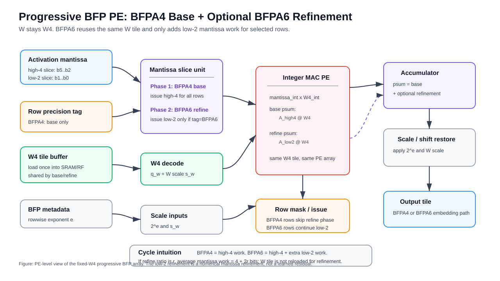

# Progressive BFP Array Design And Experiments

本文档专门整理后端 BFP 阵列的设计与实验路线。它不讨论 SimHash / CAM / Residual-Gate 的算法细节，只关注：

```text
miss / reject nodes 进入 encoder 之后，
W4 + BFPA4/BFPA6 的 NPU array 如何执行，
以及需要哪些实验来证明这个阵列设计有效。
```

当前论文主线中，前端 reuse/residual 已经能减少一部分 encoder 调用。BFP 阵列要回答的是剩余问题：

```text
对必须重新编码的 miss nodes，
如何用一个固定硬件阵列支持低成本 BFPA4 和可选 BFPA6 refinement？
```

---

## 1. 设计目标

### 1.1 输入输出

BFP 阵列接收前端输出的 encoder request：

```text
node_id
token rows
route = encoder_miss / residual_reject
graph risk / selector score
target precision tag:
    BFPA4
    BFPA6
```

阵列输出：

```text
node_id
LLM encoder embedding
```

下游 GNN 不需要知道 embedding 来自 BFPA4 还是 BFPA6。

### 1.2 硬件目标

阵列不是任意混合精度阵列，而是固定目标：

```text
W:
    固定 W4，沿用 AWQ W4 weight path。

A:
    BFP activation。
    BFPA4 是低成本 base path。
    BFPA6 是 optional refinement。
```

核心目标：

```text
1. BFPA4 能作为低成本底座。
2. BFPA6 能作为性价比最高的 refinement 档。
3. 同一套 array 支持 BFPA4/BFPA6，不为两个精度启动不同 kernel。
4. miss nodes 通过 risk / selector 分组后，提高 W tile reuse。
```

BFPA8 不作为在线硬件必须支持的执行档。它可以继续作为离线 reference pool，用于评估 BFPA6 与高精度 BFP 的精度差距。

---

## 2. BFP 数值格式

### 2.1 Rowwise BFP block

当前主线采用 rowwise `1 x 128` BFP block：

```text
一个 token row 的连续 128 个 activation value 共享一个 exponent。
每个 value 保存自己的 signed mantissa。
```

对于 block 内第 `i` 个 activation：

```text
x_i ~= 2^e * m_i
```

其中：

```text
e:
    block shared exponent

m_i:
    signed mantissa
    BFPA4 -> 4-bit mantissa
    BFPA6 -> 6-bit mantissa
```

选择 rowwise `1 x 128` 的原因：

```text
1. 与常见 AWQ group_size=128 对齐。
2. 不跨 token/node row 共享 exponent，避免不同节点动态范围互相污染。
3. full activation-level pool 已验证 rowwise BFPA4 比 cross-row BFPA4 稳定。
```

### 2.2 为什么不用 cross-row BFP 作为主线

曾经探索过 cross-row tile BFP，例如：

```text
T16x8:
    16 个 token rows x 8 hidden dims 共享一个 exponent。

T32x4:
    32 个 token rows x 4 hidden dims 共享一个 exponent。
```

真实 full encoder pool 的结果显示，cross-row BFPA4 全层使用过激，drop 明显高于 rowwise BFPA4。原因是不同 token/node row 的 activation 动态范围差异较大，一个 outlier row 会拉高 shared exponent，使其他 row 的 mantissa 精度浪费。

因此当前阵列设计采用：

```text
rowwise BFP for numerical safety
risk-bucket scheduler for W tile reuse
```

也就是说，图信息不再用于强行把多行塞进同一个 BFP exponent block，而是用于组织 miss-node rows 的执行顺序。

---

## 3. Array 计算模型

### 3.1 GEMM 形式

LLaMA encoder 中的主要算子是：

```text
Y = X @ W
```

其中：

```text
X:
    BFP activation tile
    shape = M x K

W:
    W4 weight tile
    shape = K x N

Y:
    output tile
    shape = M x N
```

真实 encoder batch 下：

```text
M = node_batch * sequence_length
```

例如：

```text
node_batch = 4
sequence_length = 512
M = 2048 token rows
```

因此阵列实验不能只看 `M=16/32/64` 的 toy case；必须补 `M=2048/4096/8192/16384` 级别。

### 3.2 W4 x BFPA 的 MAC

对一个 BFP block：

```text
x_i ~= 2^e * m_i
w_i ~= s_w * q_i
```

其中：

```text
q_i:
    W4 quantized integer

s_w:
    W4 group scale / dequant scale

m_i:
    BFP mantissa integer
```

GEMM 的核心累加可以分成两步：

```text
integer partial sum:
    psum_int = sum_i m_i * q_i

scale restore:
    psum = 2^e * s_w * psum_int
```

硬件上，PE array 主要做：

```text
mantissa integer x W4 integer
integer accumulation
block exponent / scale shift
```

这样比 FP activation x INT weight 更硬件友好。

---

## 4. Progressive BFP Execution

### 4.1 Base + refinement

BFPA6 可以看成 BFPA4 base 加上 extra mantissa planes。这里的
`refinement` 不是 learned residual，也不是重新运行另一套 encoder，而是把同一个
BFP activation mantissa 的低 2 位补算回来。

```text
BFPA4:
    high 4 mantissa bits

BFPA6:
    high 4 mantissa bits + extra 2 mantissa bits
```

概念上：

```text
Y4 = A_hi4 @ W4

Y6 = A_hi4 @ W4
   + A_extra2 @ W4
```

这里的 `extra2` 不是新的 learned correction matrix，而是同一个 activation mantissa 低位的数值 refinement。

更具体地，假设一个 BFPA6 mantissa 为：

```text
m6 = b5 b4 b3 b2 b1 b0
```

BFPA4 base 使用高 4 位：

```text
m4 = b5 b4 b3 b2
```

BFPA6 refinement 使用剩余低 2 位：

```text
extra2 = b1 b0
```

数值上：

```text
m6 = (m4 << 2) + extra2
```

因此：

```text
m6 * W4 = ((m4 * W4) << 2) + (extra2 * W4)
```

阵列执行时先计算所有需要 encoder 的 rows 的 `m4 * W4` base partial sum；只有被 selector 标记为 BFPA6 的 rows，才继续发射 `extra2 * W4` refinement，并把结果按对应 shift / exponent scale 加回同一个 output tile。

一个最小例子：

```text
BFPA6 mantissa = 101101b = 45

high4 = 1011b = 11
low2  = 01b   = 1

45 * W = (11 * W) * 4 + (1 * W)
```

所以 BFPA6 refinement 的含义是：

```text
BFPA4 base:
    先算 high-4 mantissa 与 W4 的乘积。

BFPA6 refinement:
    对需要保护的 rows，追加 low-2 mantissa 与同一个 W4 tile 的乘积。
```

关键性质：

```text
1. 不重新加载另一份 W。
2. 不启动另一个 kernel。
3. 不学习额外 correction matrix。
4. refinement 只增加被保护 rows 的 extra mantissa cycles。
```

### 4.2 平均执行深度

如果一个 miss-node batch 中有比例 `r` 的 rows 需要 BFPA6 refinement，其余 rows 只走 BFPA4 base，则平均 mantissa 执行深度为：

```text
avg_bits = 4 * (1 - r) + 6 * r
         = 4 + 2r
```

例如：

```text
r = 0.30:
    avg_bits = 4.6

相对 all-BFPA6:
    4.6 / 6 = 76.7%
    mantissa MAC activity 约少 23.3%

相对 all-BFPA4:
    4.6 / 4 = 115.0%
    额外付出约 15% mantissa work
```

因此 progressive BFP 的目标不是追求最低 bit，而是在 BFPA4 的低成本基础上，用少量 BFPA6 refinement 拉回精度。

### 4.3 对周期的影响

如果阵列按 mantissa slice 执行，则单个 row 的 mantissa compute cycles 与执行的 mantissa 位数近似成正比：

```text
BFPA4 row:
    high-4 mantissa slice
    -> 4-bit work

BFPA6 row:
    high-4 mantissa slice
    + low-2 refinement slice
    -> 6-bit work
```

所以单个 row 从 BFPA4 升到 BFPA6，mantissa compute work 增加：

```text
(6 - 4) / 4 = 50%
```

但 full batch 中只有比例 `r` 的 rows 触发 refinement，因此 batch-level 平均开销是：

```text
avg_bits = 4 + 2r
```

例如 `r = 0.30` 时：

```text
avg_bits = 4.6

vs all-BFPA4:
    +15% mantissa compute

vs all-BFPA6:
    -23.3% mantissa compute
```

这也是 progressive BFP 的硬件意义：不是把所有 miss rows 都拖到 BFPA6，而是在 BFPA4 base 上只给少量高风险 rows 追加 low-2 mantissa cycles。

周期影响分为两层：

```text
PE / mantissa path:
    BFPA6 rows 多执行 extra-2 mantissa MAC。

W path:
    BFPA4 和 BFPA6 使用同一个 W4 tile。
    refinement 不增加 W HBM reload。
```

因此 refinement 的额外代价主要来自：

```text
extra mantissa issue cycles
extra activation mantissa reads
extra psum update
```

而不是：

```text
extra W matrix
extra W tile load
extra full encoder pass
```

### 4.4 为什么阵列应该 BFPA6-capable

实验趋势上：

```text
BFPA4:
    成本最低，但在 full-stack 下可能带来额外 drop。

BFPA6:
    当前主线 refinement 档，用较小额外开销恢复 BFPA4 的精度损失。
```

因此阵列的合理硬件点不是“只做 BFPA4”，也不是“所有节点固定 BFPA6”，而是：

```text
一个 BFPA6-capable W4 array：
    默认能跑 BFPA4 base；
    对需要保护的 rows 追加 BFPA6 refinement；
```

BFPA8 不作为在线硬件必须支持的执行档。它可以继续作为离线 reference pool，用于评估 BFPA6 与高精度 BFP 的精度差距。

这样能够支撑论文中的硬件贡献：

```text
progressive mantissa refinement
```

而不是简单套用固定 W4BFPA4 或 W4BFPA6。

---

## 5. Hardware Overview

### 5.1 整体模块

Progressive BFP encoder 的硬件可以拆成五个主要模块：

```text
Encoder miss queue
    |
    v
Risk / precision scheduler
    |
    v
Activation BFP loader + metadata buffer
    |
    v
W4 weight-tile buffer  --->  W4 x BFP systolic array  --->  psum / output buffer
    |
    v
Scale / exponent restore
```

各模块职责：

```text
Encoder miss queue:
    接收前端 direct / residual 之后剩余的 miss / reject nodes。

Risk / precision scheduler:
    根据 selector score 给 miss rows 打 BFPA4 或 BFPA6 标签。
    当前实验支持 Random / Degree / TSER。

Activation BFP loader:
    读取 token rows 的 BFP mantissa 和 rowwise exponent metadata。

W4 weight-tile buffer:
    一次加载一个 W4 tile 到片上。
    同一个 W tile 连续服务多个 token-row blocks。

W4 x BFP systolic array:
    执行 mantissa integer x W4 integer MAC。
    BFPA4 rows 执行 base mantissa。
    BFPA6 rows 执行 base mantissa + extra mantissa refinement。

Scale / exponent restore:
    用 BFP exponent 和 W4 scale 恢复输出尺度。
```

### 5.2 固定硬件、可配置策略

硬件固定支持：

```text
W:
    W4 integer weight

A:
    rowwise BFP activation
    BFPA4 base
    BFPA6 refinement

Dataflow:
    W-stationary systolic GEMM
```

运行时可配置的是少量 policy register：

```text
score threshold T
residual accept threshold
refine ratio
selector mode: random / degree / tser / numeric+graph
service window: b16 / b32 / b64
```

这些 register 不改变阵列结构，只改变 request 接收宽松程度、miss rows 的 refinement 选择和 tile 调度窗口。

---

## 6. PE Microarchitecture



图中展示的是一个 PE 级别的数据流。BFPA4 rows 只执行 high-4 mantissa base phase；BFPA6 rows 在同一个 W4 tile 生命周期内继续执行 low-2 mantissa refinement。这个 refinement 是 activation mantissa 低位的数值补算，不是 learned residual，也不需要重新加载另一份 W。

### 6.1 PE 输入

每个 PE 接收：

```text
activation mantissa slice:
    BFPA4 / BFPA6 mantissa bits

activation block exponent:
    shared exponent e

W4 integer:
    q_w

W4 scale:
    s_w or per-group scale metadata

precision tag:
    P4 / P6
```

### 6.2 PE 内部模块

一个合理的 PE 可以拆成：

```text
1. Mantissa unpack / slice unit
   取 BFPA4 base bits 或 extra refinement bits。

2. W4 decode unit
   读取 W4 integer 和 group scale。

3. Integer MAC unit
   计算 mantissa_int * W4_int。

4. Accumulator
   累加 integer partial sum。

5. Scale / shift unit
   根据 BFP exponent 和 W scale 恢复数值尺度。

6. Precision control
   根据 row tag 决定是否执行 extra mantissa planes。
```

### 6.3 base/refinement 执行时序

对同一个 W tile，阵列按 row precision tag 执行：

```text
BFPA4 row:
    issue high-4 mantissa MAC
    finish output tile

BFPA6 row:
    issue high-4 mantissa MAC
    issue extra-2 mantissa MAC
    accumulate into the same output tile
```

关键点：

```text
1. BFPA6 refinement 不重新加载另一个 W。
2. extra-2 mantissa 使用同一个 W4 tile。
3. 输出 partial sum 在同一个 tile 生命周期内完成 base + refinement。
```

因此 progressive refinement 的额外开销主要是：

```text
extra mantissa MAC cycles
extra activation mantissa reads
slightly longer psum lifetime for refined rows
```

它不需要新的权重矩阵，也不需要额外 learned correction。

更直观的数据流如下：

```text
             W4 tile loaded once
                     |
                     v
        +--------------------------+
        |      W4 x BFP PE array   |
        +--------------------------+
             ^                ^
             |                |
    high-4 mantissa      low-2 mantissa
    base slice           refinement slice
    all encoder rows     BFPA6 rows only
             |                |
             +--------+-------+
                      v
             base psum + refinement psum
```

如果 BFPA4 和 BFPA6 rows 混在一个 micro-batch 中，阵列需要 row tag / row mask 来避免 BFPA4 rows 在 refinement phase 中被空转拖到 6-bit。更稳的调度方式是：

```text
1. 对同一个 W tile，先执行 BFPA4 base phase。
2. 对标记为 BFPA6 的 rows，继续执行 extra-2 refinement phase。
3. BFPA4 rows 在 extra phase 不发射。
```

这样 progressive BFP 的 latency / activity 才与实际 BFPA6 row 比例相关。

### 6.4 两种 PE 设计选项

#### Option A: bit-sliced PE

```text
每次处理一个 mantissa slice，而不是固定一次性处理完整 6-bit。
BFPA4 执行 high-4 base slice。
BFPA6 在 high-4 base 后追加 low-2 refinement slice。
```

优点：

```text
自然支持 BFPA4/BFPA6。
控制逻辑清晰。
可以复用同一个 W tile。
BFPA4 rows 不需要占用 low-2 refinement cycles。
```

缺点：

```text
latency 和 mantissa depth 相关。
需要处理 extra slice 的调度与 accumulation。
```

#### Option B: fixed BFPA6 PE + mask

```text
PE 默认支持 6-bit mantissa。
BFPA4 row 只启用高 4-bit，低 2-bit mask 掉。
BFPA6 row 全启用。
```

优点：

```text
实现简单。
BFPA6 是主目标。
```

缺点：

```text
如果 mask 后没有真正减少 issue cycles，只能省部分 activity，latency 收益有限。
```

当前更推荐 Option A，因为它更能体现 progressive refinement 的硬件意义。

这里的 bit-sliced PE 不等同于每拍只处理 1 bit 的极端 bit-serial 设计。当前主线更接近：

```text
mantissa-sliced execution:
    high-4 slice 作为 base
    low-2 slice 作为 optional refinement
```

也就是说，它继承 bit-serial / bit-sliced 的可变位宽执行能力，但以 BFPA4/BFPA6 这两个硬件友好的 slice 为主。

---

## 7. Buffer And Metadata Design

### 7.1 Activation buffer

当前主线不要求 HBM 使用非标准 4-bit / 6-bit activation layout。更实际的设计是：

```text
HBM / DMA:
    使用 byte-aligned container 传输 activation tile。

On-chip:
    unpack 成 BFP mantissa + exponent metadata。
    BFPA4 只消费 high-4 mantissa。
    BFPA6 再消费 extra-2 mantissa。
```

这样避免了 6-bit 非对齐 HBM burst、地址生成和跨 cache-line packing 的复杂度。代价是 activation HBM payload 不一定随 BFPA4/BFPA6 完全等比例下降；主要收益来自片上 mantissa MAC activity 和 miss-node W tile 调度。

### 7.2 Exponent metadata

rowwise `1 x 128` BFP block 意味着：

```text
hidden dim = 4096
block size = 128
exponent blocks per token row = 4096 / 128 = 32
```

如果每个 exponent 用 8 bit 存储，则：

```text
node_batch = 4
sequence_length = 512
M = 2048 token rows

exponent metadata = 2048 * 32 byte = 64 KB
BFPA4 mantissa payload = 2048 * 4096 * 4 bit = 4 MB

metadata / mantissa payload = about 1.6%
```

因此 exponent metadata 需要被建模，但不是主要存储负担。

### 7.3 W tile buffer

典型 W tile：

```text
tile_k = 128
tile_n = 128
W4 payload = 128 * 128 * 4 bit = 8 KB
```

同一个 LLaMA 线性层的完整 W 很大：

```text
4096 x 4096 W4:
    about 8 MB

4096 x 11008 W4:
    about 22 MB
```

所以阵列不假设整层 W 常驻片上。它假设：

```text
一次只缓存一个或少量 W tiles；
通过 service window 让一个 W tile 连续服务更多 token rows；
减少同一 W tile 的重复加载。
```

### 7.4 Psum / output buffer

BFPA6 rows 需要在 high-4 base 后继续追加 extra-2 refinement。实现上有两种方式：

```text
homogeneous precision batch:
    BFPA4 rows 和 BFPA6 rows 分开调度。
    BFPA6 rows 在同一次 tile residency 内完成 base + extra。
    控制简单，利用率稳定。

mixed precision mask:
    BFPA4/BFPA6 rows 混在同一 micro-batch。
    BFPA4 rows 在 extra cycles 中被 mask。
    控制简单但 lane utilization 可能下降。
```

当前更推荐 homogeneous precision batch，因为它能减少分支和 mask 导致的阵列空转。

---

## 8. Array-Level Dataflow

### 8.1 W-stationary dataflow

阵列采用 W-stationary：

```text
for each layer:
  for each GEMM:
    for each W tile:
        load W tile into SRAM / RF
        stream selected token rows
        compute X_tile @ W_tile
        evict W tile
```

一个典型 W tile：

```text
128 x 128 W4:
    128 * 128 * 4 bit = 65,536 bit = 8 KB
```

整个矩阵：

```text
4096 x 4096 W4:
    about 8 MB

4096 x 11008 W4:
    about 22 MB
```

所以不能假设整层 W 常驻片上。阵列设计要解决的是：

```text
每次加载一个 W tile 后，
让它服务尽可能多的有效 token rows。
```

### 8.2 Risk bucket 与 service window

前端输出 miss nodes 后，后端按风险和 precision tag 组织 token rows：

```text
BFPA4 rows
BFPA6 refinement rows
```

service window 表示一个 W tile 换出前服务多少 token-row blocks：

```text
b16:
    service 16 blocks

b32:
    service 32 blocks

b64:
    service 64 blocks
```

这里的 `b32 / b64` 不是 bit-width。它们是调度窗口。

更大的 window 带来：

```text
好处:
    W tile load 被更多 rows 摊薄。

代价:
    需要更多 row buffering。
    可能增加等待时间。
    bucket 太小时会退化。
```

### 8.3 一个 W tile 的执行例子

以 `128 x 128 W4` tile 为例：

```text
1. Load W tile:
       8 KB W4 payload + scale metadata

2. Select row block:
       从 miss queue 中取同 precision / 同 bucket 的 token rows

3. Execute BFPA4 base:
       high-4 mantissa x W4

4. Optional BFPA6 refinement:
       仅对 refine rows 追加 extra-2 mantissa x W4

5. Write output tile:
       输出进入下一层或 embedding pooling path

6. Keep or evict W tile:
       如果 bucket 里还有 rows，继续服务；
       否则换下一个 W tile。
```

这个过程的关键是：

```text
同一 W tile 对所有节点相同；
不同节点只是在 activation mantissa depth 和调度顺序上不同；
图前端提供 risk / reuse 信息，让后端知道哪些 miss rows 可以组成更稳定的 service window。
```

---

## 9. Selector And Control Policy

### 9.1 当前 selector

当前实验主要比较：

```text
Random:
    随机选择一部分 miss rows 升到 BFPA6。

Degree:
    传播风险更高的 miss rows 升到 BFPA6。

TSER:
    使用 TSER score 综合传播风险和语义风险。
```

当前 Cora/PubMed 的趋势显示，单纯 Degree/TSER 在 BFPA4/BFPA6 selector 上不总是显著优于 Random。后续更完整的 selector 应加入 BFP 数值压力：

```text
graph risk:
    节点误差对 GNN 传播的影响。

BFP stress:
    当前 row / block 用 BFPA4 是否数值危险。
```

### 9.2 推荐 selector 形式

一个轻量可实现的 selector：

```text
score(v) =
    lambda_g * normalize(graph_risk(v))
  + lambda_b * normalize(bfp_stress(v))
```

其中：

```text
graph_risk:
    degree / propagation / TSER score

bfp_stress:
    activation block dynamic range
    exponent outlier ratio
    BFPA4 vs BFPA6 estimated quantization residual
```

硬件上，`graph_risk` 来自前端 metadata，`bfp_stress` 可以由 activation loader 在 BFP block 统计阶段顺带产生。

---

## 10. Cost Accounting

最终评估需要把成本拆成以下几类：

```text
W tile load:
    W4 tile 从 HBM/LLC 到片上 buffer 的次数。

Activation load:
    token rows 和 BFP metadata 的读入。

Mantissa MAC:
    high-4 base cycles 和 optional extra-2 refinement cycles。

Psum / output:
    output tile accumulation 和写回。

Scheduler overhead:
    bucket fill、row reorder、precision tag 管理。
```

Progressive BFP 的收益来源要分清：

```text
BFPA4/BFPA6:
    主要减少 mantissa MAC 和片上 activity。

W-stationary service window:
    主要摊薄 W tile load。

front-end reuse/residual:
    直接减少进入 encoder 的 node 数。
```

对 BFPA6 refinement 的单独开销可以写成：

```text
refine_ratio = 需要 BFPA6 的 miss rows 比例

avg_mantissa_bits = 4 + 2 * refine_ratio

mantissa_activity_vs_BFPA4 = avg_mantissa_bits / 4
mantissa_activity_vs_BFPA6 = avg_mantissa_bits / 6
```

例如 `refine_ratio = 0.30`：

```text
avg_mantissa_bits = 4.6

vs all-BFPA4:
    4.6 / 4 = 1.15
    多约 15% mantissa activity

vs all-BFPA6:
    4.6 / 6 = 0.767
    少约 23.3% mantissa activity
```

这个公式只描述 mantissa path。端到端 cost 还要叠加：

```text
W tile load / reuse
activation load
output writeback
scheduler overhead
```

因此报告里应避免只用 bit 数推导整体加速，而要同时报告 mantissa activity 和 full-stack normalized cost。

报告时应同时给出：

```text
accuracy drop
normalized cost
W tile load count
average mantissa depth
service-window utilization
```

---

## 11. 需要补齐的实验

当前已有的 embedding-pool 实验只能说明：

```text
BFPA4/BFPA6 对下游 GNN 精度有什么影响。
```

它还不能完整证明：

```text
这个 BFP array 具体省了多少 cycles / traffic / energy。
```

因此需要四层实验。

---

## 12. Experiment Layer 1: Numerical Correctness

### 12.1 目标

证明软件 BFP pool 与阵列数值定义一致：

```text
rowwise BFP quantization
mantissa bits
shared exponent
W4 scale
progressive refinement
```

### 12.2 实验

构造小矩阵：

```text
X: random / sampled activation
W: sampled W4 tile
```

比较：

```text
FP reference
software W4BFPA4
software W4BFPA6
array-model W4BFPA4
array-model W4BFPA6
```

指标：

```text
max_abs_error
mean_abs_error
cosine similarity
relative output error
```

通过标准：

```text
array-model 和 software pool 的误差接近。
BFPA6 明显优于 BFPA4。
```

---

## 13. Experiment Layer 2: PE / Tile Microbench

### 13.1 目标

证明同一个 W tile 下，BFPA4/BFPA6 的 PE activity 和 cycles 有清晰差异。

### 13.2 GEMM 形状

至少覆盖 LLaMA-7B 的三类关键 GEMM：

```text
Q/K/V/O projection:
    M x 4096  @ 4096 x 4096

FFN gate/up:
    M x 4096  @ 4096 x 11008

FFN down:
    M x 11008 @ 11008 x 4096
```

其中 `M` 要覆盖真实 token-row 数：

```text
M = 2048 / 4096 / 8192 / 16384
```

### 13.3 指标

```text
cycles
PE active cycles
integer MAC count
SRAM reads/writes
W tile loads
activation reads
psum reads/writes
energy proxy
array utilization
```

### 13.4 对比

```text
All BFPA6
All BFPA4
BFPA4 base + 20% BFPA6 refinement
BFPA4 base + 30% BFPA6 refinement
BFPA4 base + 40% BFPA6 refinement
```

这里的实验必须区分：

```text
activity saving:
    少做 mantissa-plane MAC。

latency saving:
    issue cycles 是否真的减少。

memory saving:
    W tile / activation / psum traffic 是否减少。
```

如果只减少 activity 但 cycles 不变，说明阵列仍然被 memory 或固定调度开销限制。

---

## 14. Experiment Layer 3: Scheduler / W Tile Reuse

### 14.1 目标

证明 risk-bucket scheduler 能让 W tile 服务更多有效 rows。

### 14.2 输入 trace

从 full-stack 前端实验导出：

```text
node_id
route:
    direct
    residual
    miss
precision tag:
    BFPA4 / BFPA6
sequence length
risk score
```

只对 miss/reject nodes 做后端 replay。

### 14.3 调度策略

对比：

```text
original order:
    按图输入顺序进入 encoder。

random order:
    打乱 miss nodes。

risk-bucket order:
    按 precision tag / risk bucket 分组。

oracle-size bucket:
    只用于上界，不作为主线。
```

### 14.4 指标

```text
W tile load count
average service window
tail utilization
queue waiting cycles
bucket fill rate
cycles / traffic / energy
```

关键不是手工设定 `Wscale`，而是从 trace replay 统计：

```text
一个 W tile 实际服务了多少 token-row blocks。
```

---

## 15. Experiment Layer 4: Full-Stack Evaluation

### 15.1 目标

把前端 reuse/residual 与后端 BFP array 串起来：

```text
SimHash / CAM
Residual-Gate
Progressive BFP selector
BFP array cost model
GNN accuracy
```

### 15.2 主表

最终需要类似下面的表：

| Method | Reuse | Miss | Backend | Cost/Cycles | Traffic | Drop |
|---|---:|---:|---|---:|---:|---:|
| Reuse + All BFPA6 miss | ... | ... | BFPA6 | ... | ... | ... |
| Reuse + All BFPA4 miss | ... | ... | BFPA4 | ... | ... | ... |
| Reuse + Progressive BFP | ... | ... | BFPA4/BFPA6 | ... | ... | ... |
| Reuse + Progressive BFP + bucket scheduler | ... | ... | BFPA4/BFPA6 + WS | ... | ... | ... |

### 15.3 数据集

最低需要：

```text
Cora:
    快速验证阵列设计。

PubMed:
    中等规模稳定性。

Arxiv:
    大规模 stress test。
```

---

## 16. 必须回答的几个问题

### 16.1 BFPA6 是否值得做成 refinement 主档

需要证明：

```text
BFPA6 refinement 相比 BFPA4 能稳定降低 drop。
BFPA6 的额外 mantissa-plane 开销小于直接提高所有 miss nodes 精度。
```

如果 BFPA6 与离线 BFPA8 reference 的精度差距很小，则在线阵列只支持到 BFPA6 是合理的。

### 16.2 BFPA4 base 是否足够安全

需要区分两种使用方式：

```text
All BFPA4:
    全部 miss nodes 都走 BFPA4。

Progressive BFPA4:
    大部分 miss nodes 走 BFPA4；
    高风险 / 高 stress nodes 提升到 BFPA6。
```

如果 All BFPA4 drop 太高，但 progressive BFPA4+BFPA6 可控，则说明阵列需要 refinement，而不是固定 BFPA4。

### 16.3 Graph selector 是否真的有用

需要对比：

```text
Random
Degree
TSER
BFP stress
Degree + BFP stress
TSER + BFP stress
```

如果图风险单独区分度不足，最终 selector 需要同时纳入数值侧的 BFP stress：

```text
graph risk:
    判断任务传播敏感性。

BFP stress:
    判断低 mantissa 是否数值危险。
```

两者结合才是后端 BFP selector 的完整逻辑。

### 16.4 阵列收益来自哪里

最终报告必须拆分：

```text
reuse:
    少跑 encoder。

BFPA4/BFPA6:
    少做 mantissa MAC / 降低 activation precision cost。

W-stationary bucket:
    减少 W tile reload / 提高 tile service window。
```

不能只给一个总 speedup，否则很难说明 BFP 阵列本身的贡献。

---

## 17. 推荐实验顺序

### Step A: Array functional model

实现一个独立 Python / C++ model：

```text
input:
    X tile
    W4 tile
    BFP block metadata
    precision tag

output:
    Y tile
    activity counters
```

先保证数值和现有 BFP wrapper 一致。

### Step B: ONNXim / microbench 接入

基于 LLaMA GEMM shapes：

```text
M = 2048 / 4096 / 8192 / 16384
K/N = LLaMA projection / FFN dimensions
```

输出：

```text
cycles
read/write request
PE utilization
activity energy proxy
```

### Step C: Full-stack trace replay

使用前端导出的真实 miss-node trace：

```text
route trace + precision tag + sequence length
```

跑：

```text
original order
risk bucket order
service window b16/b32/b64
```

### Step D: Accuracy + hardware joint table

把 embedding-pool accuracy 和 array cost 合并：

```text
same routing policy:
    one row for accuracy
    one row for hardware cost
```

这样才能形成论文主表。

---

## 18. 当前结论

当前 BFP 阵列还没有完整闭环，已经有的是：

```text
1. BFP activation pools:
   BFPA4 / BFPA6 embedding-level main validation。
   BFPA8 作为离线 reference validation。

2. Progressive BFP full-stack:
   front-end reuse/residual + miss-node BFPA4/BFPA6 routing。

3. Roofline / W-stationary intuition:
   大 M 下 W tile amortization 后，activation precision 的收益更有意义。
```

缺的是：

```text
1. BFPA4/BFPA6 array-level functional model。
2. PE / tile 级 activity 和 cycles 统计。
3. service-window scheduler 的真实 trace replay。
4. accuracy 和 hardware cost 的统一主表。
```

这部分补齐后，BFP 阵列才能从“后端量化策略”变成论文里可以单独支撑贡献的“NPU execution unit”。
