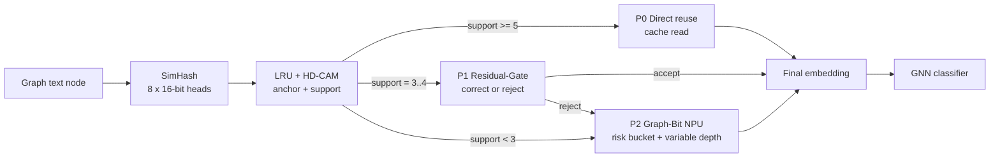

# Residual-Gate Reuse and Graph-Bit NPU Progress

本文记录当前两条主线的技术机制和实验进展：

```text
1. SimHash residual-gate:
   用 residual adapter 和 learned accept gate 拯救 fuzzy match。

2. Graph-Bit NPU:
   对必须进入 encoder 的 miss nodes，使用图风险控制可变 activation-depth 执行。
```

---

## 0. Overall Pipeline

整个系统可以分成四个连续模块：

```text
SimHash:
    为每个图文本节点生成多头 hash signature。

LRU-CAM:
    在 embedding cache 中做近似匹配，找可复用 anchor。

Residual-Gate Reuse:
    对 fuzzy match 做 residual correction 和 accept/reject 判断。

Graph-Bit NPU:
    对 reject / miss nodes 执行 graph-risk-guided variable-depth encoder。
```

整体数据流如下：



四个模块的作用边界：

| Module | Input | Output | Role |
|---|---|---|---|
| SimHash | text / graph context | multi-head hash | 生成可检索签名 |
| LRU-CAM | hash signature | anchor candidates + support | 快速找可复用节点 |
| Residual-Gate Reuse | fuzzy anchor pair | corrected embedding or reject | 拯救中等置信 fuzzy match |
| Graph-Bit NPU | miss / rejected nodes | encoder embedding | 降低剩余 encoder 计算成本 |

执行路径可以概括为：

```text
high-confidence CAM hit:
    cache read only

fuzzy CAM hit:
    residual correction if accept gate passes

CAM miss / rejected fuzzy hit:
    Graph-Bit NPU computes encoder embedding
```

---

## 1. SimHash Residual-Gate

### 1.1 核心机制

SimHash/CAM 先负责找 anchor。当前主线使用 `8 heads x 16 bit`，`support` 表示 8 个 hash head 里有多少个 head 支持同一个 anchor：

```text
support >= 5:
    high-confidence hit
    直接复用 anchor embedding

support = 3..4:
    fuzzy hit
    进入 residual-gate

support < 3:
    low-confidence / miss
    重新运行 encoder 或进入 Graph-Bit NPU
```

Residual-gate 只处理中间态 fuzzy hit。它的思路很直接：

```text
CAM 找到 anchor u
MLP 根据 (v, u) 的轻量 pair feature 预测一个 residual delta
accept gate 判断这个 fuzzy hit 是否值得继续复用
```

在线公式：

```text
delta_vu, accept_score = MLP(z_vu)

if accept_score >= tau:
    E_hat(v) = E(u) + alpha * delta_vu
else:
    reject -> compute / Graph-Bit encoder
```

其中：

```text
E(u):
    cache 中已有的 anchor embedding

z_vu:
    cheap/context feature difference
    + CAM support / distance / cosine
    + degree / graph risk signals

alpha:
    residual 强度

tau:
    accept gate 阈值
```

### 1.2 MLP 如何训练

Residual MLP 需要一小组 calibration pairs：

```text
(target node v, anchor node u)
```

训练时需要目标 encoder 的真实 embedding：

```text
E(v), E(u)
```

监督目标是让：

```text
E(u) + delta_vu  接近  E(v)
```

因此：

```text
如果当前目标 encoder 是 ST:
    用 ST embedding 训练 residual MLP。

如果当前目标 encoder 是 LLaMA-7B:
    用 LLaMA-7B embedding 训练 residual MLP。
```

cheap feature 可以来自轻量模型，但监督目标必须来自当前要加速的目标 encoder。在线阶段不需要访问目标节点的 full embedding，只需要 anchor embedding 和轻量 pair feature。

---

### 1.3 当前实验进展

共享在线 residual-gate 配置：

```text
8 heads x 16 bit
radius = 2
score gate on
score weights = 3 / 1 / 1
support >= 5   -> direct reuse
support = 3..4 -> residual candidate
support < 3    -> compute
```

在当前 residual-gate 实验记录中，Cora / PubMed 3-run 结果如下：

| Dataset | Baseline Acc | ResidualReuse | Acc | Drop | TrainPairs | Alpha |
|---|---:|---:|---:|---:|---:|---:|
| Cora | 0.7200 | 46.5% | 0.7107 | 0.93% | 464.7 | 0.263 |
| PubMed | 0.7587 | 42.3% | 0.7392 | 1.96% | 151.3 | 0.309 |

对应消融：

| Dataset | Config | Reuse | Drop |
|---|---|---:|---:|
| Cora | DirectReuse | 16.0% | 0.40% |
| Cora | SoftDirectReuse | 46.5% | 1.77% |
| Cora | ResidualReuse | 46.5% | 0.93% |
| PubMed | DirectReuse | 25.7% | 1.04% |
| PubMed | SoftDirectReuse | 42.3% | 4.48% |
| PubMed | ResidualReuse | 42.3% | 1.96% |

---

## 2. Graph-Bit Variable-Depth NPU Unit

### 2.1 问题

SimHash residual-gate 只能处理可复用节点。对于 reject / miss nodes，仍然需要运行 LLM encoder。

Graph-Bit NPU 处理的是这部分 miss nodes：

```text
reuse / residual 前端:
    减少进入 encoder 的节点数量。

Graph-Bit NPU:
    降低剩余 miss nodes 的 encoder 执行成本。
```

---

### 2.2 基本思想

Graph-Bit 的核心是把“节点重要性不同”转化成“encoder GEMM 内部算术努力不同”。  
它不是简单把全图节点按固定比例分成 P8/P6/P4，也不是离线指定某些节点永远用低位宽。原因有两点：

```text
1. 不同数据集的 risk 分布不同，固定比例不稳。
2. 同一个节点是否能提前停止，应该由当前 bit-plane 剩余误差上界决定，
   而不是只由一个静态分组决定。
```

因此当前主线采用 nodewise predictor-free bound：

```text
graph risk -> min_depth + tolerance
runtime bound -> actual stop depth
```

图风险只负责给每个 miss node 设置两类运行时约束：

```text
min_depth:
    最低安全 bit-depth。
    风险越高，min_depth 越高。

tolerance:
    剩余低位 bit-plane 可接受的误差上界。
    风险越高，tolerance 越小。
```

之后 NPU 在 bit-serial GEMM 执行过程中，从高位到低位逐步累加 partial sum，并在每个候选 depth 检查剩余低位的理论上界。如果上界已经小于该节点的 tolerance，就停止继续执行低位。

对每个 miss node：

```text
risk_norm(v) = clamp(risk(v) / risk_max, 0, 1)

tolerance(v) =
    min_tol + (max_tol - min_tol) * (1 - risk_norm(v))^gamma

for depth in min_depth..8:
    if remaining_low_bit_bound(depth) <= tolerance(v):
        stop at depth
        break
```

这意味着：

```text
高风险节点:
    tolerance 小，bound 不容易满足，更接近 P8。

低风险节点:
    tolerance 大，bound 更容易满足，更容易停在 P6/P5/P4。

实际 P8/P7/P6/P5/P4 分布:
    由 runtime bound 逐节点产生，
    不是预设比例。
```

这个机制保留了两层安全性：

```text
第一层:
    graph risk 先给出 min_depth，避免低风险以外的节点过早停止。

第二层:
    predictor-free bound 再判断低位是否可以跳过，
    避免只凭 degree/TSER 静态决定最终位宽。
```

从硬件角度看，Graph-Bit NPU 对 miss nodes 做的是：

```text
1. 按 graph risk 组织执行队列。
2. 在 W-stationary systolic array 中加载 W tile。
3. token rows 流过同一个 W tile。
4. bit-serial controller 从高位 activation bit-plane 开始执行。
5. runtime bound 满足后，停止后续低位 effort。
```

因此 Graph-Bit 的完整思想是：

```text
graph risk controls scheduling;
runtime bound controls stop depth;
W-stationary dataflow turns grouped miss nodes into tile reuse;
bit-serial execution turns stop depth into arithmetic activity reduction.
```

---

### 2.3 Predictor-Free Bound

这一部分的思想来源于 HPCA'26 PADE 这类 predictor-free sparse attention accelerator。PADE 的核心观察是：不需要额外训练一个稀疏预测器，也可以在 bit-serial 计算过程中用数值上下界判断某些后续计算是否还可能改变最终重要性结论。

PADE 的执行逻辑可以概括为：

```text
1. 按 bit-plane 从高位到低位逐步计算 attention score。
2. 每执行一部分高位，就维护当前 partial sum。
3. 用剩余低位 bit-plane 的最大可能贡献构造 upper/lower bound。
4. 如果 bound 已经证明该 candidate 不可能影响 top-k / sparse attention 结果，
   就停止后续低位计算。
```

因此 PADE 的 “prediction-free” 含义是：

```text
不额外训练 predictor；
用 bit-level bound 在执行过程中做安全判断。
```

Graph-Bit 借鉴的是这个 predictor-free bound 思路，但应用对象和优化目标不同：

```text
PADE:
    作用于 sparse attention。
    bound 判断某个 attention candidate 是否还可能影响 top-k / sparse pattern。

Graph-Bit:
    作用于 graph-text encoder 的 projection / FFN GEMM。
    bound 判断低位 activation bit-plane 是否还值得继续执行。
```

Graph-Bit 的新增点是把图后端风险接入 bound 策略：

```text
graph risk / degree / propagation risk
    -> min_depth
    -> tolerance
    -> runtime stop depth
```

也就是说，同一个数值 bound 在不同节点上有不同的停止条件：

```text
high-risk node:
    tolerance 小，需要更完整的 bit-depth。

low-risk node:
    tolerance 大，可以更早停止低位 bit-plane。
```

这使得 Graph-Bit 不是普通的 bit-serial early termination，而是：

```text
graph-conditioned predictor-free execution
```

前期也测试过更粗粒度的 encoder 约简方式，例如只运行 LLaMA 的部分层并缓存 `L16 / L24` 等 partial-depth embedding。实验结果显示，这类“跳层 / 少跑层数”会造成明显精度掉点，不能稳定替代完整 encoder。因此当前主线不再从 layer depth 上截断模型，而是保留完整层结构，在每个 GEMM 内部做 variable activation-depth 执行。

activation 逻辑上是 A8：

```text
A8 = b7 b6 b5 b4 b3 b2 b1 b0
```

bit-serial 执行从高位到低位：

```text
P8: b7..b0
P7: b7..b1
P6: b7..b2
P5: b7..b3
P4: b7..b4
```

执行到某个 depth 后，剩余低位 bit-plane 的最大可能贡献有一个上界：

```text
remaining_low_bit_bound(depth)
```

当前 validation 侧使用归一化低位范围作为近似：

```text
omitted = 2^(8 - depth) - 1
bound   = scale * omitted / (2^8 - 1) * sqrt(tile_k / 128)
```

例子：

```text
depth = 6:
    omitted = 3
    bound = 3 / 255 = 0.01176

depth = 5:
    omitted = 7
    bound = 7 / 255 = 0.02745
```

如果当前节点的 tolerance 大于该 bound，就停止低位执行。

这个过程不使用 learned predictor，也不使用 oracle error。

前期也探索过把 activation 改成 2-bit plane-group / bit-plane-major layout，希望在 early stop 后连低位 activation 加载也一起跳过。当前结论是这条路的 tradeoff 较高：

```text
1. activation HBM traffic 不是当前主要瓶颈；
2. layout 修改会引入 reformat / 格式转换开销；
3. 因此不把 activation layout 改造作为主线。
```

当前主线保留 bit-serial early stop 对 PE / RF / psum 活动的约简，把主要数据流收益放在后面的 W-stationary bucket scheduling。

---

### 2.4 NPU 数据流

Graph-Bit NPU 使用 weight-stationary systolic dataflow。

LLM encoder 中 projection / FFN 的核心计算是：

```text
Y = X @ W
```

其中：

```text
W:
    模型权重，对所有节点和 token rows 共享。

X:
    miss nodes 的 token rows。
```

这里的 `W tile` 指的是从大权重矩阵中切出来的一小块，不是把整层甚至整模型权重都放进片上 SRAM。

以 LLaMA-7B 为例，raw FP16 权重量级约为：

```text
7B parameters * 16 bit ~= 14 GB
```

raw W4 权重量级约为：

```text
7B parameters * 4 bit ~= 3.5 GB
```

实际存储还会包含 scale / zero-point / metadata，因此这个数字只是权重 payload 的量级。无论哪种情况，整模型权重都不可能整体常驻一个小片上 buffer。

再看单个 Linear GEMM 的量级：

```text
projection / QKV / O:
    X: [M, 4096]
    W: [4096, 4096]
    W4 size ~= 8 MB

FFN gate / up:
    X: [M, 4096]
    W: [4096, 11008]
    W4 size ~= 22 MB

FFN down:
    X: [M, 11008]
    W: [11008, 4096]
    W4 size ~= 22 MB
```

一个 LLaMA layer 内的 Q/K/V/O + FFN gate/up/down 这些 Linear 权重，在 W4 下仍然是约百 MB 级别。Graph-Bit 调度的基本单位是更小的 tile，例如：

```text
128 x 128 W4 tile
    = 128 * 128 * 4 bit
    = 65,536 bit
    = 8 KB
```

因此，数据流里的 `load W tile into SRAM / RF` 更准确地说是：

```text
从 HBM / LLC 读取一个 8KB 量级的小 W tile，
放入片上 SRAM / RF，
让尽可能多的 token rows 连续消费这个 tile，
再换出下一个 W tile。
```

数据流：

```text
for each layer:
    for each GEMM:
        for each W tile:
            load W tile into SRAM / RF
            stream token rows from risk bucket
            execute bit-serial GEMM
            apply predictor-free early stop
            evict W tile
```

核心收益来自两部分：

```text
1. variable activation depth:
   减少 PE MAC、W RF broadcast、psum update 等片上活动。

2. risk-bucket W-stationary scheduling:
   让同风险 miss nodes 连续消费同一个 W tile，
   减少 W tile reload。
```

第二点是 Graph-Bit 相对普通 Transformer accelerator 的关键机会。普通 Transformer accelerator 通常只看到一批独立 sequence / token rows，不知道哪些节点在图任务里是高风险、低风险，也不知道哪些节点已经被 SimHash / CAM 前端过滤掉。Graph-Bit 的前端会产生额外的图任务信息：

```text
reuse / residual front-end:
    哪些节点不需要进入 encoder。

graph risk / degree / propagation score:
    剩余 miss nodes 中，哪些节点需要更保守计算，
    哪些节点可以更激进 early stop。
```

因此 miss nodes 可以先按风险分桶，再送入 encoder：

```text
high-risk bucket:
    更完整 bit-depth，更保守 tolerance。

mid / low-risk bucket:
    更容易提前停止低位 bit-plane。
```

所有节点本来就使用同一个 LLaMA 权重 `W`。risk bucket 不是为了让“相同风险节点才共享 W”，而是为了让 stop-depth / tolerance 相近的 token rows 连续执行。这样同一个 `W tile` 加载到片上 SRAM / RF 后，面对的是一串控制流相似的 token rows，PE issue、W RF broadcast 和 psum update 更规整，tile 可以在换出前服务更多 rows。这个机会来自图前端提供的 risk / reuse 信息，不是普通无图 Transformer batch 自然具备的信号。

这里的 `b16 / b32 / b64` 表示 W tile 的 service window，不是 bit-width：

```text
b16:
    一个 W tile 在换出前服务 16 个 token-row blocks。

b32:
    一个 W tile 在换出前服务 32 个 token-row blocks。

b64:
    一个 W tile 在换出前服务 64 个 token-row blocks。
```

service window 越大，单个 W tile 的 HBM 读取越能被更多 token rows 摊薄；但也要求 risk bucket 里有足够多的 miss-node token rows，并且片上 buffer / scheduler 能支撑更长的 tile 驻留时间。

两类机制在数据流中分别提供不同收益：

```text
variable activation depth:
    同一 risk bucket 内的节点使用相近 min_depth / tolerance。
    低风险节点更早停止低位 bit-plane，
    减少 PE MAC、W RF broadcast、activation RF access、
    partial-sum read/update/write 等片上活动。

risk-bucket W-stationary scheduling:
    同风险 miss nodes 连续流过同一个 W tile。
    一个 W tile 在换出前服务更多 token rows，
    降低 W tile reload 次数，提高 weight-stationary 阵列利用率。
```

这两部分是配套关系：risk bucket 先把执行流组织成更规整的同风险 token-row batch，variable-depth controller 再在 bucket 内执行更一致的 bit-serial early stop。

硬件 profile 需要使用真实 encoder GEMM 行数：

```text
M = node_batch * sequence_length
```

小 M microbenchmark 容易低估 variable-depth 对 compute path 的影响；面向 TAPE / DyLGNN 这类 graph-text encoder 前端时，`M` 通常来自多个节点和 padding 后 token rows 的乘积，应按真实 batch / sequence setting 重新 profile。

---

### 2.5 与 FlashAttention 思想的关系

Graph-Bit 借鉴的是 FlashAttention 的 IO-aware 原则：

```text
把可复用 tile 留在片上
让连续的消费者数据流过这个 tile
减少同一 tile 的反复 HBM 读取
```

区别在于作用对象不同：

```text
FlashAttention:
    面向 attention tile 和 online softmax。

Graph-Bit:
    面向 encoder Linear / FFN 的 W tile。
    graph risk 决定哪些 miss-node token rows 应该一起消费该 W tile。
```

因此 Graph-Bit 不是直接复用 FlashAttention 算法，而是把它的 tile-stationary 思想迁移到 graph-text encoder workload。

---

### 2.6 当前实现进展

当前代码路径已经支持：

```text
1. W4A8 / W4A7 / W4A6 / W4A5 / W4A4 embedding pool 作为 accuracy validation target。
2. nodewise predictor-free bound assignment。
3. per-node stop-depth trace 导出。
4. residual/reuse 前端与 Graph-Bit miss-node 后端连接。
5. ONNXim component simulation 和 trace-driven scheduler replay。
```

关键入口：

```text
GraphhopSimhash/scripts/run_t31_graphbit_nodewise_bound_sweep.sh
GraphhopSimhash/scripts/run_graphbit_predictor_free_flow.sh
```

---

### 2.7 当前快速结果

固定 T31 前端，在 Cora/Llama2-7B W4A8 family 上做 nodewise bound quick sweep：

| Policy | P8 | P7 | P6 | P5 | P4 | AvgDepth | Drop | Cost Save vs FullP8-miss |
|---|---:|---:|---:|---:|---:|---:|---:|---:|
| mild | 0.1% | 4.8% | 55.5% | 0.0% | 0.0% | 6.08 | 2.85% | 20.13% |
| normal | 0.0% | 0.3% | 22.3% | 37.7% | 0.0% | 5.38 | 3.53% | 27.72% |
| steep | 0.3% | 4.6% | 42.7% | 12.7% | 0.0% | 5.88 | 3.05% | 22.44% |
| strong | 0.0% | 0.1% | 0.5% | 33.5% | 26.0% | 4.58 | 5.27% | 36.21% |

解释：

```text
mild:
    当前 Cora quick 下最稳，
    AvgDepth 从 FullP8 的 8.00 降到 6.08，
    总 drop 控制在 3% 内。

normal / strong:
    bit-depth 更低，cost saving 更高，
    但 drop 超过当前稳健目标。
```

这组比例是逐节点 bound 运行后得到的分布，不是预设 P8/P6/P5/P4 比例。

---

## 3. 当前缺口与待验证项

当前机制链路已经跑通，但还需要补齐以下验证，才能形成更完整的 full-stack 证据：

### 3.1 前端参数口径统一

当前文档中同时保留了 ST residual-gate、Cora/LLaMA Graph-Bit 和 PubMed/LLaMA support split 的不同配置。后续需要明确每个 dataset/backend 的主线前端：

```text
ST residual-gate:
    当前共享在线配置已经有 Cora / PubMed 结果。

Cora/LLaMA Graph-Bit:
    需要固定一个通过 FullP8-miss sanity check 的前端。

PubMed/LLaMA Graph-Bit:
    需要更严格前端，避免 accepted reuse 本身带来过大 drop。
```

### 3.2 PubMed Graph-Bit full-stack 主表

Cora 已有 trace-driven replay 表；PubMed 还需要用同一口径补齐：

```text
FullP8-miss
GraphBit-now
RiskBucket-b32
RiskBucket-b64
```

表中需要同时报告：

```text
Reuse / Miss / AvgDepth / Wloads / Cycles / Traffic / Energy / Drop
```

### 3.3 HEAT-like baseline

需要构造一个清晰的对照：

```text
HEAT-like static degree precision:
    degree 直接决定静态 bit-depth
    不做 residual reuse
    不做 runtime bound
    不做 risk-bucket scheduler
```

用于和以下主线逐项比较：

```text
Reuse + FullP8-miss
Reuse + static degree bit-depth
Reuse + predictor-free Graph-Bit
Reuse + predictor-free Graph-Bit + risk-bucket W-stationary
```

这张表用于拆分收益来源：reuse/residual、runtime bound、risk-bucket W tile reuse 各自贡献多少。

### 3.4 大 M ONNXim profile

当前部分 ONNXim component lookup 仍来自小 M microbenchmark。真实 encoder GEMM 应使用：

```text
M = node_batch * sequence_length
```

建议补：

```text
M = 2048 / 4096 / 8192 / 16384
```

观察 large-M 下 variable activation depth 是否更明显转化为 cycles / energy 收益。

### 3.5 Arxiv feasibility-only

Arxiv 暂时不需要完整多 seed accuracy，但需要先做 feasibility-only：

```text
reuse / miss profile
risk bucket size
stop-depth histogram
Wloads / Wscale
SRAM feasibility
```

目标是验证大图上 risk bucket 是否更大、W tile service window 是否更容易被填满。
