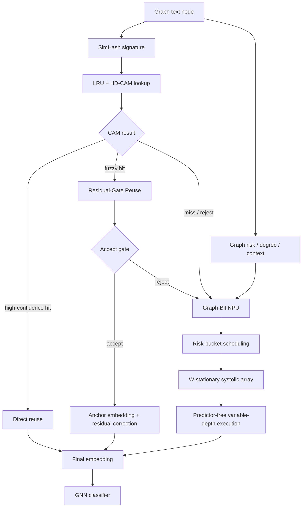

# Residual-Gate Reuse and Graph-Bit NPU Progress

本文记录当前两条主线的技术机制和实验进展：

```text
1. SimHash residual-gate:
   用 residual adapter 和 learned accept gate 拯救 fuzzy match。

2. Graph-Bit NPU:
   对必须进入 encoder 的 miss nodes，使用图风险控制可变 activation-depth 执行。
```

---

## 0. Overall Pipeline

整个系统可以分成四个连续模块：

```text
SimHash:
    为每个图文本节点生成多头 hash signature。

LRU-CAM:
    在 embedding cache 中做近似匹配，找可复用 anchor。

Residual-Gate Reuse:
    对 fuzzy match 做 residual correction 和 accept/reject 判断。

Graph-Bit NPU:
    对 reject / miss nodes 执行 graph-risk-guided variable-depth encoder。
```

整体数据流如下：



四个模块的作用边界：

| Module | Input | Output | Role |
|---|---|---|---|
| SimHash | text / graph context | multi-head hash | 生成可检索签名 |
| LRU-CAM | hash signature | anchor candidates + support | 快速找可复用节点 |
| Residual-Gate Reuse | fuzzy anchor pair | corrected embedding or reject | 拯救中等置信 fuzzy match |
| Graph-Bit NPU | miss / rejected nodes | encoder embedding | 降低剩余 encoder 计算成本 |

执行路径可以概括为：

```text
high-confidence CAM hit:
    cache read only

fuzzy CAM hit:
    residual correction if accept gate passes

CAM miss / rejected fuzzy hit:
    Graph-Bit NPU computes encoder embedding
```

---

## 1. SimHash Residual-Gate

### 1.1 问题

SimHash/CAM 前端会产生三类结果：

```text
exact / high-confidence hit:
    锚点和目标节点高度相似，可以直接复用 embedding。
    当前主线参数下对应 8 个 hash head 中 support >= 5。

fuzzy / medium-confidence hit:
    CAM 找到了相近锚点，但直接复用有误差风险。
    当前主线参数下对应 support = 3..4。

miss / rejected hit:
    复用不可靠，需要重新运行 encoder。
    当前主线参数下对应 support < 3，或 residual accept gate 拒绝。
```

仅使用 direct reuse 时，fuzzy hit 是主要矛盾：

```text
放开 fuzzy hit:
    reuse 提高，但 drop 增大。

只保留 exact hit:
    drop 很低，但 reuse 太低。
```

Residual-gate 的目标是在 fuzzy hit 上加入中间路径：

```text
anchor embedding + residual correction + accept/reject gate
```

---

### 1.2 在线执行路径

对目标节点 `v`，CAM/SimHash 找到锚点节点 `u` 后：

```text
support high:
    E_hat(v) = E(u)

support medium:
    residual path

support low:
    compute / Graph-Bit encoder
```

Residual path 的在线计算为：

```text
z_vu = pair_feature(v, u)

delta_vu, accept_score = Adapter(z_vu)

if accept_score >= tau:
    E_hat(v) = E(u) + alpha * delta_vu
else:
    reject -> compute / Graph-Bit encoder
```

其中：

```text
E(u):
    已缓存的 anchor embedding。

delta_vu:
    residual adapter 预测的 embedding 修正量。

alpha:
    residual 强度，可按 support bucket 调整。

tau:
    learned accept gate 的在线阈值。
```

代码实现中，验证阶段的 reject 会用 reference embedding 替代；部署语义上对应重新运行 encoder。

---

### 1.3 Pair Feature

Residual adapter 不从 hash bit 直接还原 embedding。Hash/CAM 只负责找锚点，adapter 只需要判断“目标节点和锚点差多少、是否值得修”。

```text
pair_feature(v, u) =
    cheap/context feature difference
  + CAM confidence signals
  + graph risk / degree signals
```

其中 CAM confidence signals 包括 Hamming distance、support count、候选 cosine 等；graph signals 包括 degree ratio 和 sensitivity/risk score。在线阶段只用这些轻量特征和已缓存的 anchor embedding，不访问目标节点的 full embedding。

---

### 1.4 Adapter 和 Gate

当前主要使用 MLP residual adapter：

```text
delta_vu = MLP(z_vu)
accept_score = sigmoid(gate_head(z_vu))
```

训练目标包括：

```text
1. correction loss:
   让 E(u) + delta_vu 接近目标 E(v)。

2. gate / accept loss:
   学习哪些 fuzzy candidate 适合继续复用，
   哪些 candidate 应该打回 compute。

3. residual regularization:
   避免修正量过大导致 embedding 空间整体扰动。
```

当前支持两类 accept mode：

```text
separate:
    correction gate 和 accept gate 分开学习。
    适合 soft hit 相对干净、希望尽量保留复用的场景。

shared:
    correction strength 和 accept/reject 共用 learned signal。
    更保守，适合 fuzzy hit 污染更重的场景。
```

---

### 1.5 技术作用

Residual-gate 提供两个能力：

```text
1. 修正 fuzzy hit:
   不改变复用率的前提下降低 embedding error / classification drop。

2. 拒绝不可靠 fuzzy hit:
   在高污染数据集上，把低质量 fuzzy candidate 打回 compute。
```

因此它不是单纯的 residual correction，而是：

```text
CAM provides anchor.
Residual adapter corrects accepted fuzzy hits.
Accept gate filters unsafe fuzzy hits.
```

---

### 1.6 当前实验进展

共享在线 residual-gate 配置：

```text
8 heads x 16 bit
radius = 2
score gate on
score weights = 3 / 1 / 1
support >= 5   -> direct reuse
support = 3..4 -> residual candidate
support < 3    -> compute
```

在当前 residual-gate 实验记录中，Cora / PubMed 3-run 结果如下：

| Dataset | Baseline Acc | ResidualReuse | Acc | Drop | TrainPairs | Alpha |
|---|---:|---:|---:|---:|---:|---:|
| Cora | 0.7200 | 46.5% | 0.7107 | 0.93% | 464.7 | 0.263 |
| PubMed | 0.7587 | 42.3% | 0.7392 | 1.96% | 151.3 | 0.309 |

对应消融：

| Dataset | Config | Reuse | Drop |
|---|---|---:|---:|
| Cora | DirectReuse | 16.0% | 0.40% |
| Cora | SoftDirectReuse | 46.5% | 1.77% |
| Cora | ResidualReuse | 46.5% | 0.93% |
| PubMed | DirectReuse | 25.7% | 1.04% |
| PubMed | SoftDirectReuse | 69.5% | 4.48% |
| PubMed | ResidualReuse | 42.3% | 1.96% |

解释：

```text
Cora:
    soft hit 相对干净。
    residual 主要负责在相同 reuse 下拉回精度。

PubMed:
    soft hit 更脏。
    accept gate 拒绝一部分 fuzzy hit，
    用更低 reuse 换回 2% 内 drop。
```

需要注意的 target 对齐问题：

```text
ST oracle 纠错后，严格 T31 共享配置尚未完全恢复到
“Cora/PubMed 同时 40%+ reuse 且 2% 内 drop”。

Llama2-7B W4A16 旧日志显示该方向可行，
但需要在当前代码和当前 target pool 下重新复核。
```

因此 residual-gate 的机制已经跑通；不同 encoder backend 下需要使用各自的目标 embedding 训练和评估 residual adapter。

---

## 2. Graph-Bit Variable-Depth NPU Unit

### 2.1 问题

SimHash residual-gate 只能处理可复用节点。对于 reject / miss nodes，仍然需要运行 LLM encoder。

Graph-Bit NPU 处理的是这部分 miss nodes：

```text
reuse / residual 前端:
    减少进入 encoder 的节点数量。

Graph-Bit NPU:
    降低剩余 miss nodes 的 encoder 执行成本。
```

---

### 2.2 基本思想

Graph-Bit 的核心是把“节点重要性不同”转化成“encoder GEMM 内部算术努力不同”。  
它不是简单把全图节点按固定比例分成 P8/P6/P4，也不是离线指定某些节点永远用低位宽。原因有两点：

```text
1. 不同数据集的 risk 分布不同，固定比例不稳。
2. 同一个节点是否能提前停止，应该由当前 bit-plane 剩余误差上界决定，
   而不是只由一个静态分组决定。
```

因此当前主线采用 nodewise predictor-free bound：

```text
graph risk -> min_depth + tolerance
runtime bound -> actual stop depth
```

图风险只负责给每个 miss node 设置两类运行时约束：

```text
min_depth:
    最低安全 bit-depth。
    风险越高，min_depth 越高。

tolerance:
    剩余低位 bit-plane 可接受的误差上界。
    风险越高，tolerance 越小。
```

之后 NPU 在 bit-serial GEMM 执行过程中，从高位到低位逐步累加 partial sum，并在每个候选 depth 检查剩余低位的理论上界。如果上界已经小于该节点的 tolerance，就停止继续执行低位。

对每个 miss node：

```text
risk_norm(v) = clamp(risk(v) / risk_max, 0, 1)

tolerance(v) =
    min_tol + (max_tol - min_tol) * (1 - risk_norm(v))^gamma

for depth in min_depth..8:
    if remaining_low_bit_bound(depth) <= tolerance(v):
        stop at depth
        break
```

这意味着：

```text
高风险节点:
    tolerance 小，bound 不容易满足，更接近 P8。

低风险节点:
    tolerance 大，bound 更容易满足，更容易停在 P6/P5/P4。

实际 P8/P7/P6/P5/P4 分布:
    由 runtime bound 逐节点产生，
    不是预设比例。
```

这个机制保留了两层安全性：

```text
第一层:
    graph risk 先给出 min_depth，避免低风险以外的节点过早停止。

第二层:
    predictor-free bound 再判断低位是否可以跳过，
    避免只凭 degree/TSER 静态决定最终位宽。
```

从硬件角度看，Graph-Bit NPU 对 miss nodes 做的是：

```text
1. 按 graph risk 组织执行队列。
2. 在 W-stationary systolic array 中加载 W tile。
3. token rows 流过同一个 W tile。
4. bit-serial controller 从高位 activation bit-plane 开始执行。
5. runtime bound 满足后，停止后续低位 effort。
```

因此 Graph-Bit 的完整思想是：

```text
graph risk controls scheduling;
runtime bound controls stop depth;
W-stationary dataflow turns grouped miss nodes into tile reuse;
bit-serial execution turns stop depth into arithmetic activity reduction.
```

---

### 2.3 Predictor-Free Bound

这一部分的思想来源于 HPCA'26 PADE 这类 predictor-free sparse attention accelerator。PADE 的核心观察是：不需要额外训练一个稀疏预测器，也可以在 bit-serial 计算过程中用数值上下界判断某些后续计算是否还可能改变最终重要性结论。

PADE 的执行逻辑可以概括为：

```text
1. 按 bit-plane 从高位到低位逐步计算 attention score。
2. 每执行一部分高位，就维护当前 partial sum。
3. 用剩余低位 bit-plane 的最大可能贡献构造 upper/lower bound。
4. 如果 bound 已经证明该 candidate 不可能影响 top-k / sparse attention 结果，
   就停止后续低位计算。
```

因此 PADE 的 “prediction-free” 含义是：

```text
不额外训练 predictor；
用 bit-level bound 在执行过程中做安全判断。
```

Graph-Bit 借鉴的是这个 predictor-free bound 思路，但应用对象和优化目标不同：

```text
PADE:
    作用于 sparse attention。
    bound 判断某个 attention candidate 是否还可能影响 top-k / sparse pattern。

Graph-Bit:
    作用于 graph-text encoder 的 projection / FFN GEMM。
    bound 判断低位 activation bit-plane 是否还值得继续执行。
```

Graph-Bit 的新增点是把图后端风险接入 bound 策略：

```text
graph risk / degree / propagation risk
    -> min_depth
    -> tolerance
    -> runtime stop depth
```

也就是说，同一个数值 bound 在不同节点上有不同的停止条件：

```text
high-risk node:
    tolerance 小，需要更完整的 bit-depth。

low-risk node:
    tolerance 大，可以更早停止低位 bit-plane。
```

这使得 Graph-Bit 不是普通的 bit-serial early termination，而是：

```text
graph-conditioned predictor-free execution
```

activation 逻辑上是 A8：

```text
A8 = b7 b6 b5 b4 b3 b2 b1 b0
```

bit-serial 执行从高位到低位：

```text
P8: b7..b0
P7: b7..b1
P6: b7..b2
P5: b7..b3
P4: b7..b4
```

执行到某个 depth 后，剩余低位 bit-plane 的最大可能贡献有一个上界：

```text
remaining_low_bit_bound(depth)
```

当前 validation 侧使用归一化低位范围作为近似：

```text
omitted = 2^(8 - depth) - 1
bound   = scale * omitted / (2^8 - 1) * sqrt(tile_k / 128)
```

例子：

```text
depth = 6:
    omitted = 3
    bound = 3 / 255 = 0.01176

depth = 5:
    omitted = 7
    bound = 7 / 255 = 0.02745
```

如果当前节点的 tolerance 大于该 bound，就停止低位执行。

这个过程不使用 learned predictor，也不使用 oracle error。

前期也探索过把 activation 改成 2-bit plane-group / bit-plane-major layout，希望在 early stop 后连低位 activation 加载也一起跳过。当前结论是这条路的 tradeoff 较高：一方面 activation 从 HBM 读取并不是主要瓶颈，另一方面 layout 修改会引入 reformat 和格式转换开销。因此当前主线保留 bit-serial early stop 对 PE / RF / psum 活动的约简，把主要数据流收益放在后面的 W-stationary bucket scheduling。

---

### 2.4 NPU 数据流

Graph-Bit NPU 使用 weight-stationary systolic dataflow。

LLM encoder 中 projection / FFN 的核心计算是：

```text
Y = X @ W
```

其中：

```text
W:
    模型权重，对所有节点和 token rows 共享。

X:
    miss nodes 的 token rows。
```

数据流：

```text
for each layer:
    for each GEMM:
        for each W tile:
            load W tile into SRAM / RF
            stream token rows from risk bucket
            execute bit-serial GEMM
            apply predictor-free early stop
            evict W tile
```

核心收益来自两部分：

```text
1. variable activation depth:
   减少 PE MAC、W RF broadcast、psum update 等片上活动。

2. risk-bucket W-stationary scheduling:
   让同风险 miss nodes 连续消费同一个 W tile，
   减少 W tile reload。
```

---

### 2.5 与 FlashAttention 思想的关系

Graph-Bit 借鉴的是 FlashAttention 的 IO-aware 原则：

```text
keep reusable tile on chip
stream consumers through it
avoid repeated HBM traffic
```

区别在于作用对象不同：

```text
FlashAttention:
    面向 attention tile 和 online softmax。

Graph-Bit:
    面向 encoder Linear / FFN 的 W tile。
    graph risk 决定哪些 miss-node token rows 应该一起消费该 W tile。
```

因此 Graph-Bit 不是直接复用 FlashAttention 算法，而是把它的 tile-stationary 思想迁移到 graph-text encoder workload。

---

### 2.6 当前实现进展

当前代码路径已经支持：

```text
1. W4A8 / W4A7 / W4A6 / W4A5 / W4A4 embedding pool 作为 accuracy validation target。
2. nodewise predictor-free bound assignment。
3. per-node stop-depth trace 导出。
4. residual/reuse 前端与 Graph-Bit miss-node 后端连接。
5. ONNXim component simulation 和 trace-driven scheduler replay。
```

关键入口：

```text
GraphhopSimhash/scripts/run_t31_graphbit_nodewise_bound_sweep.sh
GraphhopSimhash/scripts/run_graphbit_predictor_free_flow.sh
```

---

### 2.7 当前快速结果

固定 T31 前端，在 Cora/Llama2-7B W4A8 family 上做 nodewise bound quick sweep：

| Policy | P8 | P7 | P6 | P5 | P4 | AvgDepth | Drop | Cost Save vs FullP8-miss |
|---|---:|---:|---:|---:|---:|---:|---:|---:|
| mild | 0.1% | 4.8% | 55.5% | 0.0% | 0.0% | 6.08 | 2.85% | 20.13% |
| normal | 0.0% | 0.3% | 22.3% | 37.7% | 0.0% | 5.38 | 3.53% | 27.72% |
| steep | 0.3% | 4.6% | 42.7% | 12.7% | 0.0% | 5.88 | 3.05% | 22.44% |
| strong | 0.0% | 0.1% | 0.5% | 33.5% | 26.0% | 4.58 | 5.27% | 36.21% |

解释：

```text
mild:
    当前 Cora quick 下最稳，
    AvgDepth 从 FullP8 的 8.00 降到 6.08，
    总 drop 控制在 3% 内。

normal / strong:
    bit-depth 更低，cost saving 更高，
    但 drop 超过当前稳健目标。
```

这组比例是逐节点 bound 运行后得到的分布，不是预设 P8/P6/P5/P4 比例。

---
